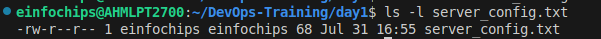
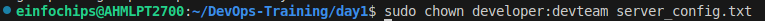
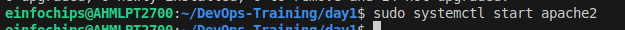
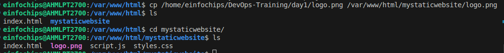

# Day-1 Task

## Project Overview

### Part 1: Creating and Editing Text Files 
Using Nano
Create a file server_config.txt using Nano:

nano server_config.txt


### Part 2: User & Group Management 

Add a new user developer:

sudo adduser developer


Remove the user developer:

sudo deluser developer


Managing Groups
Create a group devpteam:

sudo groupadd devpteam


Add the user developer to the devpteam group:

sudo usermod -aG devpteam developer


Remove the user developer from the devpteam group:

sudo gpasswd -d developer devpteam


### Part 3: File Permissions Management 
View permissions for server_config.txt:

ls -l server_config.txt


Changing Permissions and Ownership
Change permissions to read/write for the owner and read-only for others:

chmod 644 server_config.txt

Verify the change:

ls -l server_config.txt



Change the owner to developer and the group to devteam:

sudo chown developer:devteam server_config.txt



Verify the change:

ls -l server_config.txt


### Part 4: Controlling Services and Daemons 
Start the Apache service:

sudo systemctl start apache2


Stop the Apache service:

sudo systemctl stop apache2


Enable the Apache service to start on boot:

sudo systemctl enable apache2


Disable the Apache service:

sudo systemctl disable apache2


Check the status of the Apache service:

sudo systemctl status apache2


### Part 5: Process Handling 
List all running processes:

ps aux


Use top to view processes in real-time:

top


### Creating and Deploying a Static Website with Apache2

### Part 1: Installing Apache2 (5 minutes)
Update Package Lists
Open the terminal and run:

sudo apt update


Install Apache2
Install Apache2 by running:

sudo apt install apache2


Start and Enable Apache2
Start the Apache2 service:

sudo systemctl start apache2



Enable Apache2 to start on boot:

sudo systemctl enable apache2


### Part 2: Creating the Website 


cd /var/www/html


Create a New Directory for the Website


sudo mkdir mystaticwebsite


Change ownership of the directory:

sudo chown -R $USER:$USER /var/www/html/mystaticwebsite


Create HTML File
Create and edit the index.html file:

nano /var/www/html/mystaticwebsite/index.html


Add the following content:
```
<!DOCTYPE html>
<html>
<head>
  <title>My Static Website</title>
  <link rel="stylesheet" type="text/css" href="styles.css">
</head>
<body>
  <h1>Welcome to My Static Website</h1>
  <p>This is a simple static website using Apache2.</p>
  <script src="script.js"></script>
</body>
</html>
```

Create and edit the styles.css file:
```
nano /var/www/html/mystaticwebsite/styles.css
```

Add the following content:
```
body {
  font-family: Arial, sans-serif;
  background-color: #f0f0f0;
  text-align: center;
  margin: 0;
  padding: 20px;
}

h1 {
  color: #333;
}
```
Create and edit the script.js file:
```
nano /var/www/html/mystaticwebsite/script.js
```


```
document.addEventListener('DOMContentLoaded', function() {
  console.log('Hello, World!');
});
```


Add an Image
Download or copy an image file to the website directory:
```
cp /path/to/your/logo.png /var/www/html/mystaticwebsite/logo.png
```


Update index.html to include the image:
```
<body>
  <h1>Welcome to My Static Website</h1>
  
  <p>This is a simple static website using Apache2.</p>
  <script src="script.js"></script>
</body>
```

### Part 3: Configuring Apache2 to Serve the Website 
Create a Virtual Host File
Create and edit the virtual host configuration file:
```
sudo nano /etc/apache2/sites-available/mystaticwebsite.conf
```

```
<VirtualHost *:80>
  ServerAdmin webmaster@localhost
  DocumentRoot /var/www/html/mystaticwebsite
  ErrorLog ${APACHE_LOG_DIR}/error.log
  CustomLog ${APACHE_LOG_DIR}/access.log combined
</VirtualHost>
```

Enable the New Virtual Host
Enable the virtual host configuration:
```
sudo a2ensite mystaticwebsite.conf
```


Disable the Default Site
Disable the default site configuration:
```
sudo a2dissite 000-default.conf
```


Reload Apache2
Reload the Apache2 service to apply the changes:
```
sudo systemctl reload apache2
```

Test the Configuration


