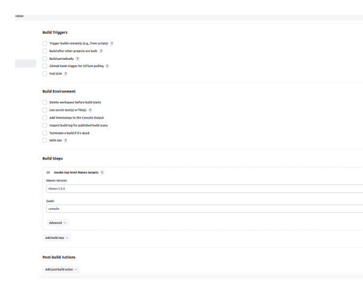

# Day 11 Task

#### Project Overview - Create a private git repo that has a maven project. In Jenkins create 2 freestyle project, one to compile that maven project and other to test that maven project. Create a pipeline view of the project.

---

#### Step 1. Create Private Git Repo

#### Step 2. Compile maven project

Creating new freestyle project

Setting up git credentails in jenkins

Configuring Freestyle Project

Setup Maven Installation in Jenkins

Setup Maven Build Steps **COMPILE**

Build "maven-project-compile" Project

---

#### Step 3. Test maven project

Creating another Freestyle Project

Configuring Freestyle Project

Setup Maven Build Steps **TEST**

Build "maven-project-test" Project

---

#### Step 4. Update Compile Project
Add the "Post-build Actions" to trigger the "maven-project-test" from "maven-project-compile"

---

#### Step 5. Pipeline view

Create new "build pipeline" in jenkins

Fill the details

Final Output

