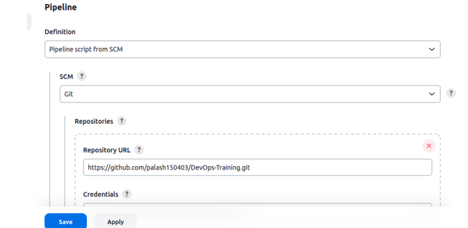
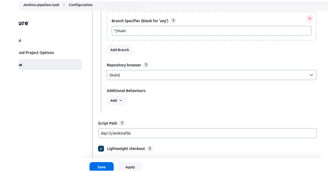
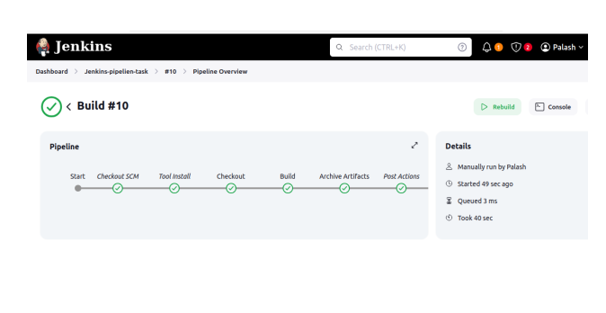

### Project Overview

Your organization is implementing continuous integration (CI) practices to streamline the software development lifecycle. As part of this initiative, you will create a Jenkins declarative pipeline for building a simple Maven project hosted on GitHub. This project aims to automate the build process, ensure code quality, and facilitate continuous delivery (CD).

### Instructions

<h4>1. Setup Jenkins Job</h4>
<li>Create a new Jenkins pipeline job.</li>
<li>Configure the job to pull the Jenkinsfile from the GitHub repository.</li>

2. Create Jenkinsfile

Write a declarative pipeline script (Jenkinsfile) that includes the following stages:

Clone Repository: Clone the Maven project from the GitHub repository.
Build: Execute the Maven build process (mvn clean install).
<li>Test: Run unit tests as part of the Maven build.</li>
<li>Archive Artifacts: Archive the build artifacts for future use.</li>

<h4>Run the Pipeline</h4>

<li>Monitor the build process through Jenkins' UI and console output.</li>

<li>Pipeline Visualization</li>

