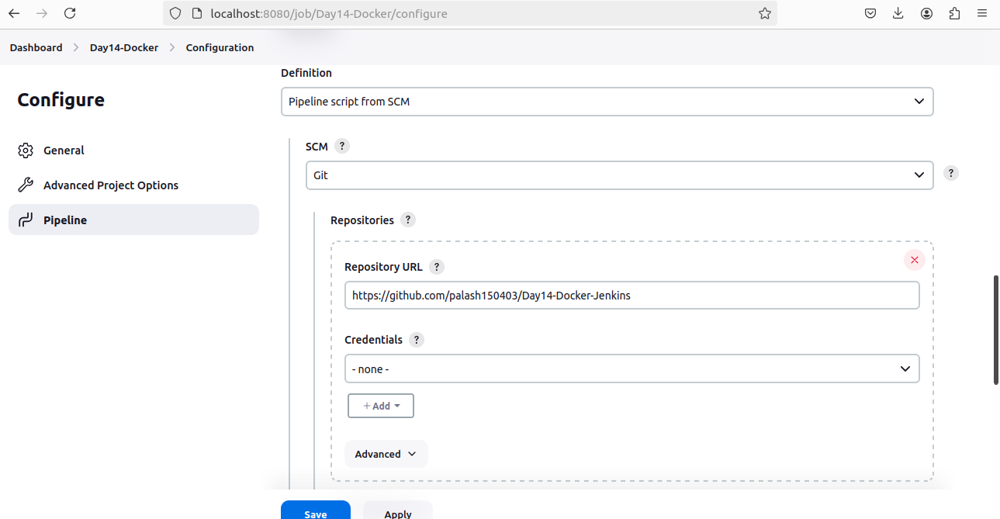

# Day14-Docker-Jenkins

## Problem Statement

You are tasked with setting up a CI/CD pipeline using Jenkins to streamline the deployment process of a simple Java application. The pipeline should accomplish the following tasks:

- Fetch the Dockerfile: The pipeline should clone a GitHub repository containing the source code of the Java application and a Dockerfile.
- Create a Docker Image: The pipeline should build a Docker image from the fetched Dockerfile.
- Push the Docker Image: The pipeline should push the created Docker image to a specified   DockerHub repository.
- Deploy the Container: The pipeline should deploy a container using the pushed Docker image.

### Deliverables

- GitHub Repository: A GitHub repository containing:
    - The source code of a simple Java application.
```
class App{
    public static void main(String args[]){
        System.out.println("Hello wold");
    }
}

```
-   
    - A Dockerfile for building the Docker image.
```
FROM openjdk:11
COPY . /usr/src/myapp
WORKDIR /usr/src/myapp
RUN javac App.java
CMD ["java", "App"]

```
- Jenkins Pipeline Script: A Jenkinsfile (pipeline script) that:
    - Clones the GitHub repository.
    - Builds the Docker image.
    - Pushes the Docker image to DockerHub.
    - Deploys a container using the pushed image.

- DockerHub Repository: A DockerHub repository where the Docker images will be stored.
 - Jenkins Setup:
    - Jenkins installed and configured on a local Ubuntu machine.
    - Required plugins installed (e.g., Git, Docker, Pipeline).

- Documentation: 

    - How to set up the local Jenkins environment.


    - Builds the Docker image.
    - Pushes the Docker image to DockerHub.


    - Final build
    
    
    
