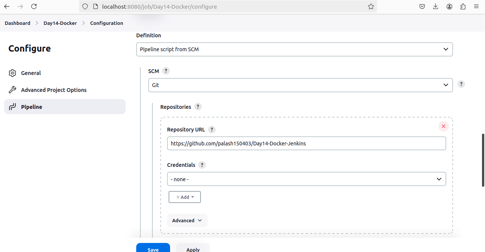

# day15-task
## Project Problem Statement
A development team needs to establish a basic CI/CD pipeline for a web application. The goal is to automate version control, containerization, building, testing, and deployment processes.
## Deliverables
### Git Repository:
#### Create a Git repository: 
-   Initialize a new repository for the web application.
#### Branching Strategy:
-   Set up main and develop branches.
-   Create a feature branch for a new feature or bug fix.

#### Add Configuration Files:
-   Create a .gitignore file to exclude files like logs, temporary files, etc.
-   Create a README.md file with a project description, setup instructions, and contribution guidelines.


### Docker Configuration:

#### Dockerfile:
-   Write a Dockerfile to define how to build the Docker image for the web application.
```
FROM openjdk:11
COPY . /usr/src/myapp
WORKDIR /usr/src/myapp
RUN javac App.java
CMD ["java", "App"]
```
#### Docker Ignore File:
-   Create a .dockerignore file to exclude files and directories from the Docker build context.
#### Image Management:
-   Build a Docker image using the Dockerfile.
-   Push the built Docker image to a container registry (e.g., Docker Hub).

### Jenkins Configuration:
#### Jenkins Job Setup:
-   Create a Jenkins job to pull code from the Git repository.
-   Configure Jenkins to build the Docker image using the Dockerfile.
-   Set up Jenkins to run tests on the Docker image.
-   Configure Jenkins to push the Docker image to the container registry after a successful build.



#### Jenkins Pipeline:
Create a Jenkinsfile to define the CI/CD pipeline stages, including build, test, and deploy.


### Ansible Playbook:
#### Basic Playbook Creation:
-   Develop an Ansible playbook to automate the deployment of the Docker container.
```
---
- name: Install Docker and Run an image
  hosts: localhost
  become: yes

  tasks:
    - name: Update apt package index
      apt:
        update_cache: yes

    - name: Upgrade all packages
      apt:
        upgrade: dist

    - name: Install dependencies for Docker
      apt:
        name:
          - apt-transport-https
          - ca-certificates
          - curl
          - software-properties-common
        state: present

    - name: Add Docker's official GPG key
      apt_key:
        url: https://download.docker.com/linux/ubuntu/gpg
        state: present

    - name: Add Docker apt repository
      apt_repository:
        repo: deb https://download.docker.com/linux/ubuntu focal stable
        state: present
        update_cache: yes

    - name: Install Python and Docker
      apt:
        name:
          - python3
          - python3-pip
          - docker-ce
        state: present

    - name: Enable Docker service
      systemd:
        name: docker
        enabled: yes

    - name: Start Docker service
      systemd:
        name: docker
        state: started

    - name: Pull Docker image
      docker_image:
        name: palash150403/jenkins_docker_image
        tag: latest
        source: pull

    - name: Run Docker container
      docker_container:
        name: my_test_container
        image: palash150403/jenkins_docker_image
        state: started
        restart_policy: always
        ports:
          - "81:80"


```
#### Playbook Tasks:
-   Install Docker on the target server (if Docker is not already installed).
-   Pull the Docker image from the container registry.
-   Run the Docker container with the required configurations.
#### Inventory File:
Create an inventory file specifying the target server(s) for deployment.
```

[localhost]
127.0.0.1 ansible_connection=local
```
