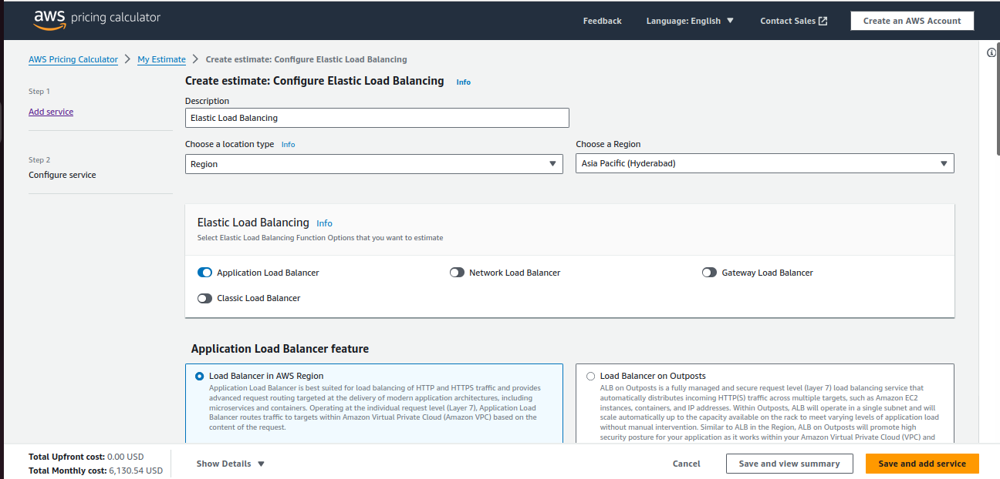
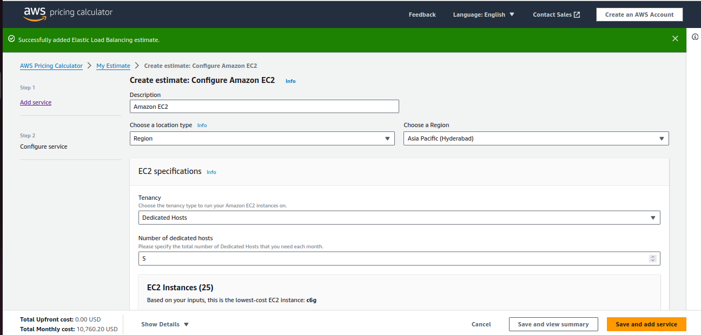
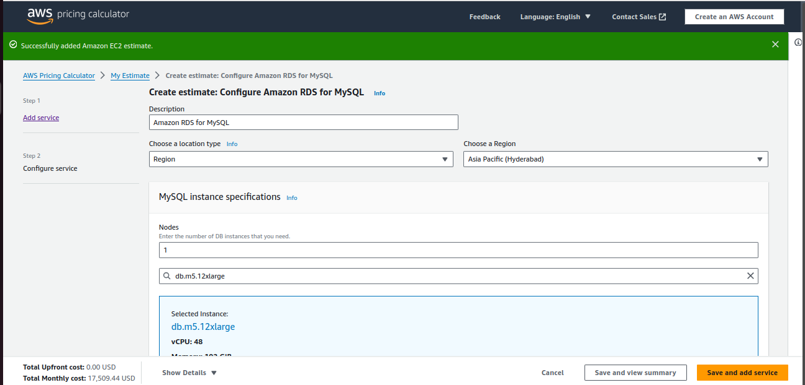

# Day-23 
## Project Breakdown
### 1. Configuring Jobs and Targets
#### Task
-   Set up a Prometheus server to monitor multiple services running on different nodes.

#### Deliverables
-   Configure Prometheus with jobs for monitoring different services like web servers, databases, and system metrics.
-   Define static and dynamic targets using file-based and service discovery methods (e.g., Consul or Kubernetes).
```
global:
  scrape_interval: 10s

scrape_configs:
  - job_name: 'node'
    static_configs:
      - targets: ['localhost:9100']
  - job_name: 'webserver'
    static_configs:
      - targets: ['54.193.29.208:8080']
  - job_name: 'MySql'
    static_configs:
      - targets: ['54.193.29.208:5432']
```
### 2. Using Exporters (Node Exporter)
#### Task 
-   Use Node Exporter to monitor system-level metrics like CPU, memory, disk usage, and network statistics.

#### Deliverables
-   Install and configure Node Exporter on all nodes.
-   Ensure Node Exporter metrics are being correctly scraped by Prometheus.
Hands-on Exercise: Setting Up Exporters

#### Steps to install Node-Exporter

-   Download the Zip
```
wget https://github.com/prometheus/node_exporter/releases/download/v1.8.2/node_exporter-1.8.2.linux-amd64.tar.gz
```
-   Unzip the file :
```
tar -xvf node_exporter-1.8.2.linux-amd64.tar.gz
```
-   Set the directory path
```
cd node_exporter-1.8.2.linux-amd64/
```
```
./node_exporter 
```


### 3. Hands-on Exercise: Setting Up Exporters

#### Task
-   Configure at least two different types of exporters and integrate them with Prometheus.

#### Deliverables
-   Demonstrate successful data collection from both exporters.
-   Create a basic Prometheus dashboard to visualize key metrics from these exporters.

### 4. Introduction to PromQL

#### Task
-   Learn and implement basic PromQL queries to extract meaningful data from the metrics collected.

#### Deliverables
-   Write basic queries to retrieve metrics like average CPU usage, memory consumption, and disk I/O over time.
```
avg(rate(node_cpu_seconds_total{mode="user"}[5m])) by (instance)
```


```
node_memory_MemTotal_bytes - node_memory_MemFree_bytes
```


```
avg(rate(node_disk_written_bytes_total[5m])) by (instance)
```

### 5. Basic Queries (Selectors, Functions, Operators)

#### Task
-   Create PromQL queries using selectors, functions, and operators to filter and manipulate time-series data.

#### Deliverables
-   Write PromQL queries to calculate the 95th percentile of CPU usage.
-   Use functions like rate(), increase(), and histogram_quantile() to perform more complex analysis.
```
rate(node_cpu_seconds_total[5m])
```

```
increase(node_cpu_seconds_total[1h])
```


### 6. Advanced Queries and Aggregations

#### Task
-   Perform advanced data aggregation using PromQL.

#### Deliverables
-   Write queries to calculate the total memory usage across all nodes.
-   Aggregate data to find the maximum disk space usage among all nodes.
```
sum(node_memory_MemTotal_bytes - node_memory_MemFree_bytes)
```

```
max(node_filesystem_size_bytes - node_filesystem_free_bytes)
```


### 7. Configuring Alertmanager

#### Task
-   Set up Alertmanager to handle alerts generated by Prometheus.

#### Deliverables
-   Configure Alertmanager with Prometheus.
-   Create routing rules to manage alert notifications based on severity and service type.

### 8. Writing Alerting Rules

#### Task
-   Write custom alerting rules in Prometheus to trigger alerts based on specific conditions.

#### Deliverables
-   Create alerting rules for high CPU usage, memory leaks, and disk space running low.
-   Ensure alerts are correctly generated and sent to Alertmanager.

### 9. Setting Up Notification Channels (Email, Slack, etc.)
#### Task
-   Integrate Alertmanager with multiple notification channels like Email and Slack.
#### Deliverables
-   Set up Email notifications for critical alerts.
-   Integrate Slack for real-time alerts and notifications.

### 10. Hands-on Exercise: Creating Alerts
#### Task
-   Test the entire alerting pipeline by creating and triggering custom alerts.

#### Deliverables
-   Simulate a scenario where a node exceeds 90% CPU usage and ensure alerts are triggered and sent to both Email and Slack.
-   Validate the alerts in both notification channels.


