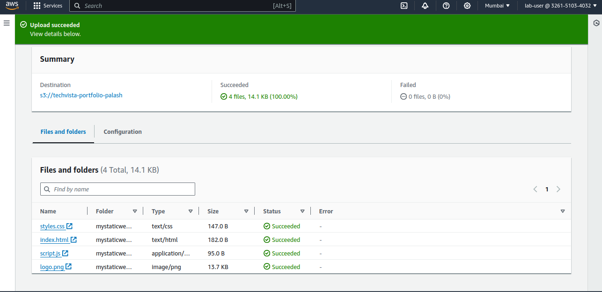
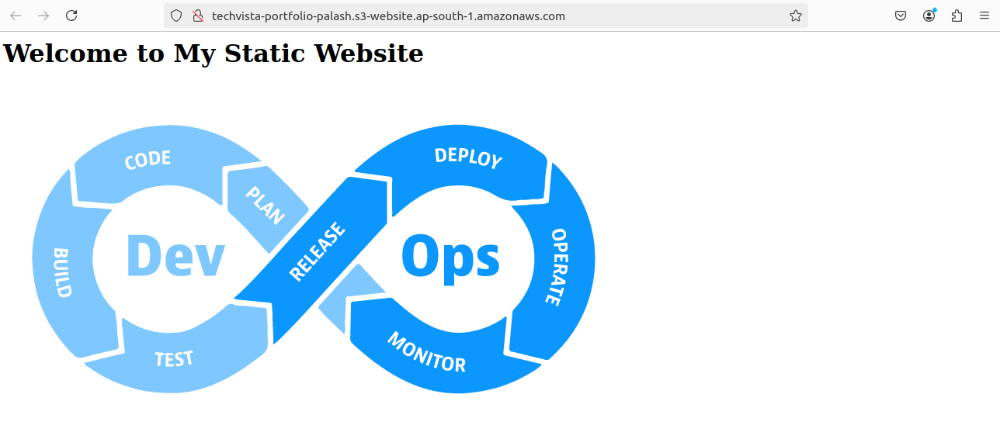
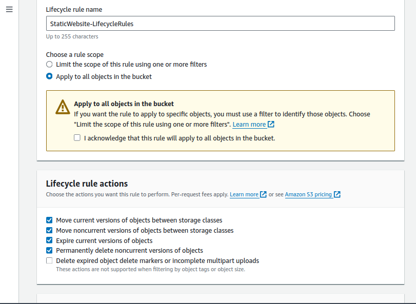
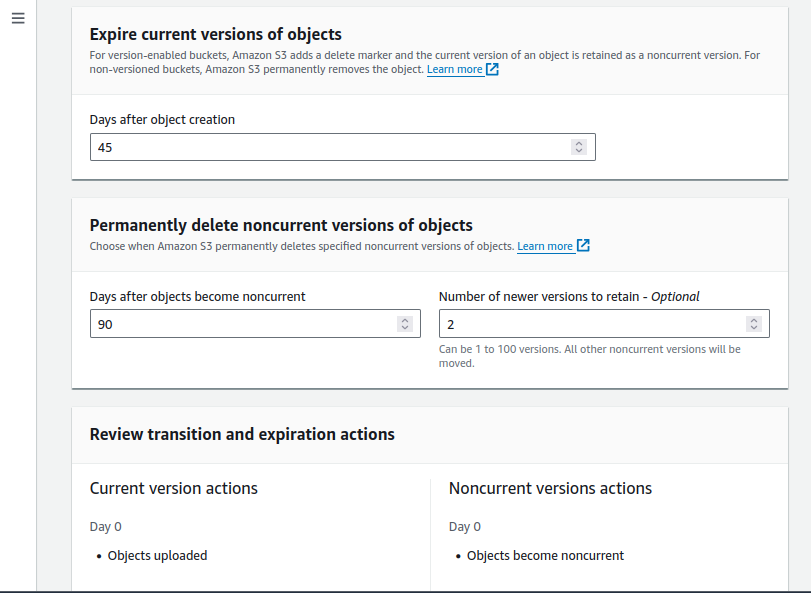
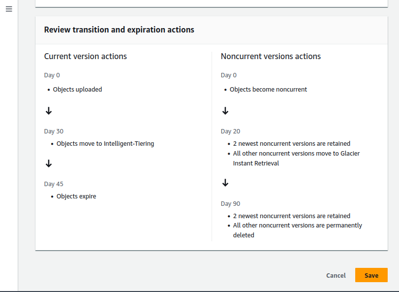
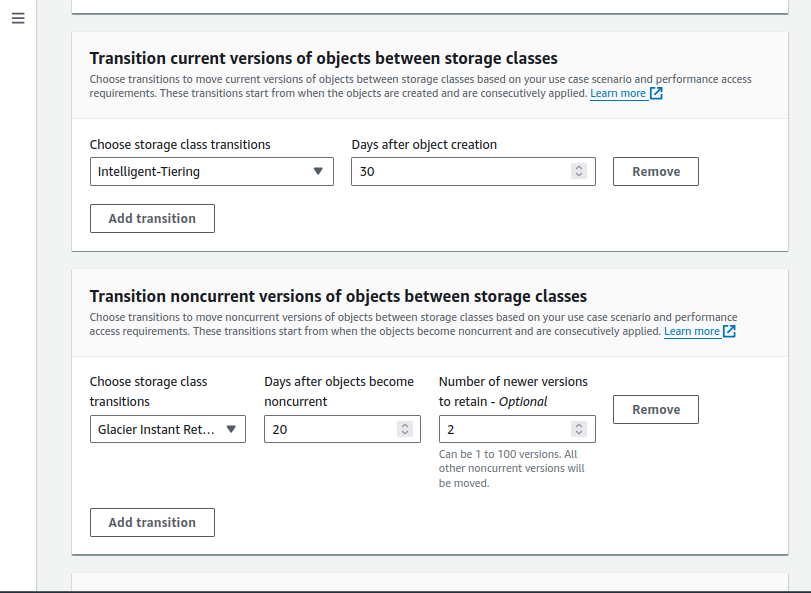
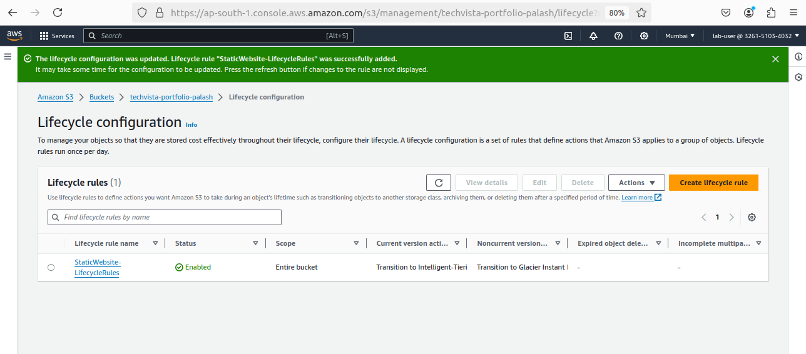
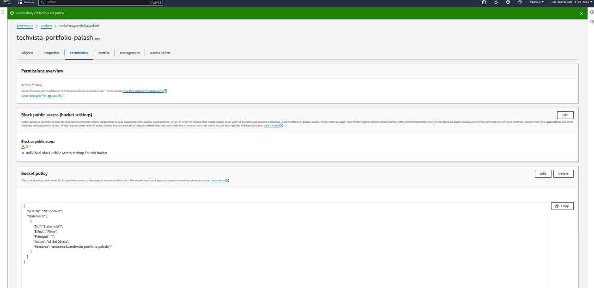
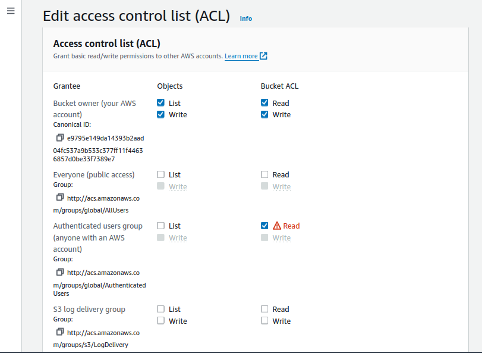

# Day 25 Task

**Project Steps and Deliverables:**

1. **Create and Configure an S3 Bucket:**
 - Create an S3 bucket named techvista-portfolio-palash.

 
 - Enable versioning on the bucket.

 - Set up the bucket for static website hosting.

 - Upload the provided static website files (HTML, CSS, Js, images).



 - Ensure the website is accessible via the S3 website URL.
```
http://techvista-portfolio-palash.s3-website.ap-south-1.amazonaws.com/
```




2. **Implement S3 Storage Classes:**
 - Classify the uploaded content into different S3 storage classes (e.g., Standard, Intelligent-Tiering, Glacier).


 - Justify your choice of storage class for each type of content (e.g., HTML/CSS files vs. images).
     - I chose the Standard storage class for HTML and js files because they are accessed frequently whenever users visit the website.
    - For images, I selected the Intelligent-Tiering storage class because they are updated regularly and often feature new content.

3. **Lifecycle Management:**
 - Create a lifecycle policy that transitions older versions of objects to a more cost-effective storage class (e.g., Standard to Glacier).

 - Set up a policy to delete non-current versions of objects after 90 days.









 - Verify that the lifecycle rules are correctly applied.




4. **Configure Bucket Policies and ACLs:**
 - Create and attach a bucket policy that allows read access to everyone for the static website content.



 - Set up an ACL to allow a specific external user access to only a particular folder within the bucket.




