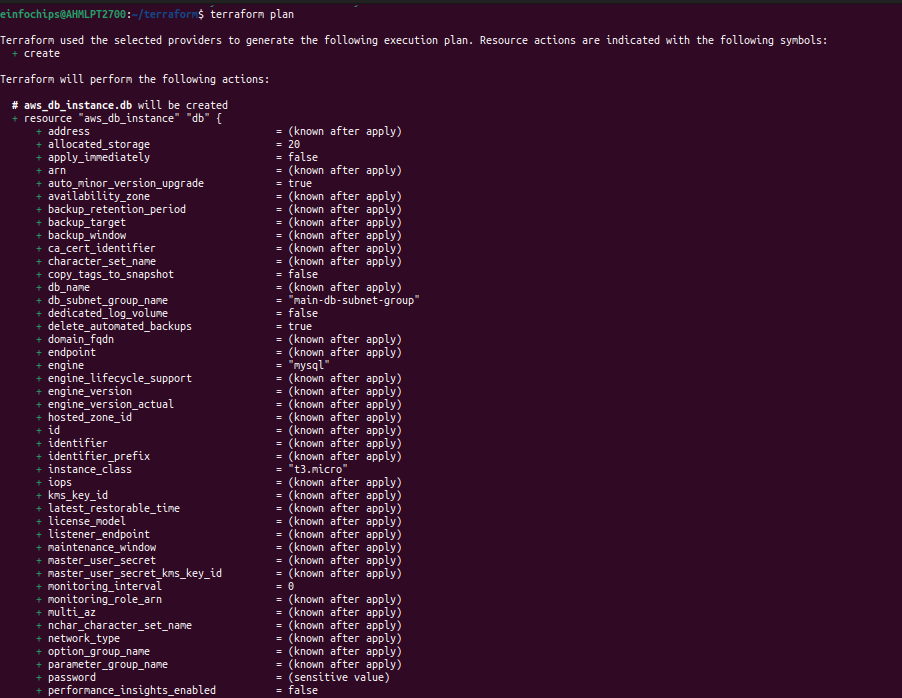
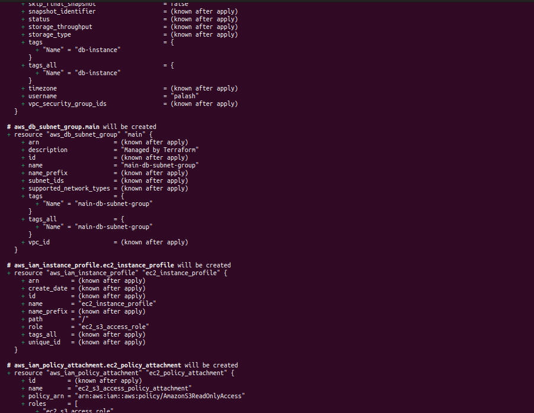
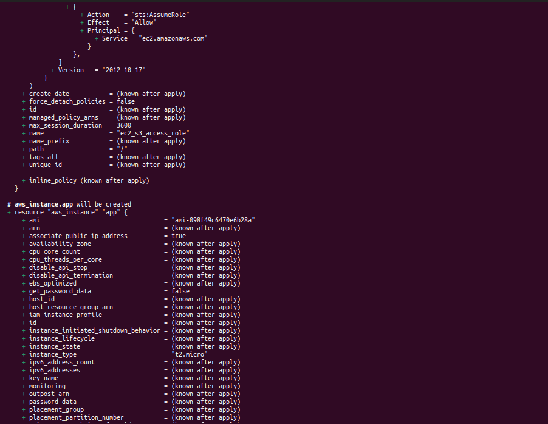
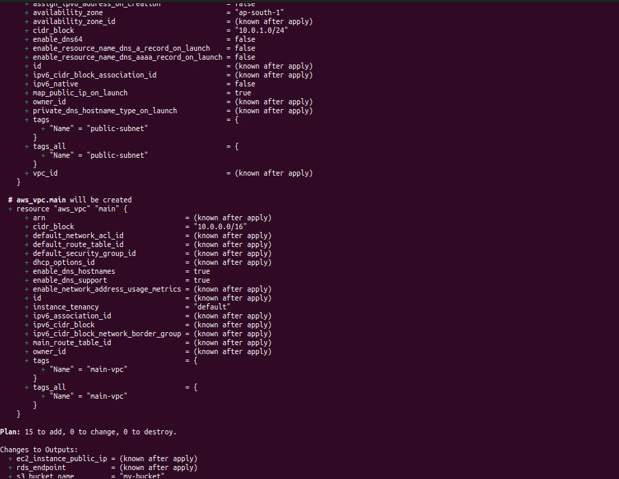
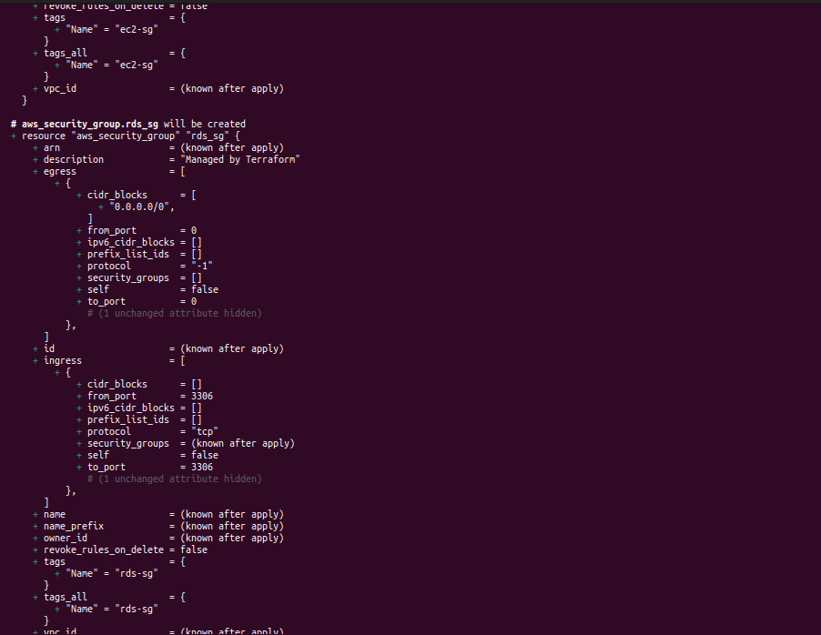
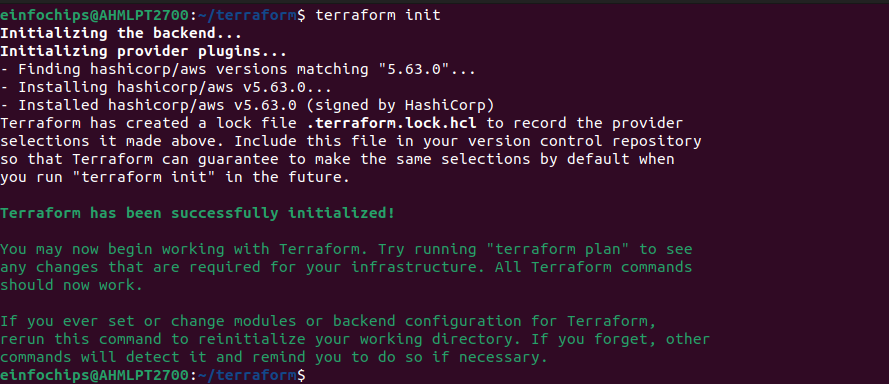
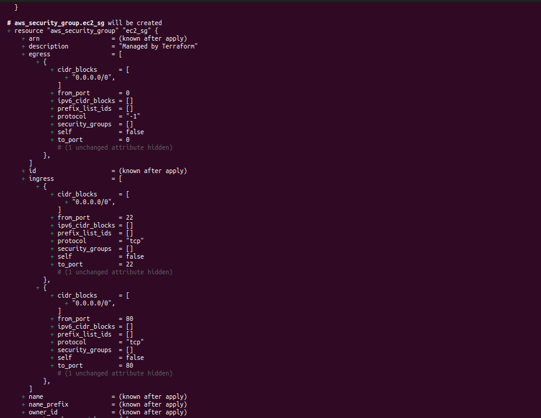
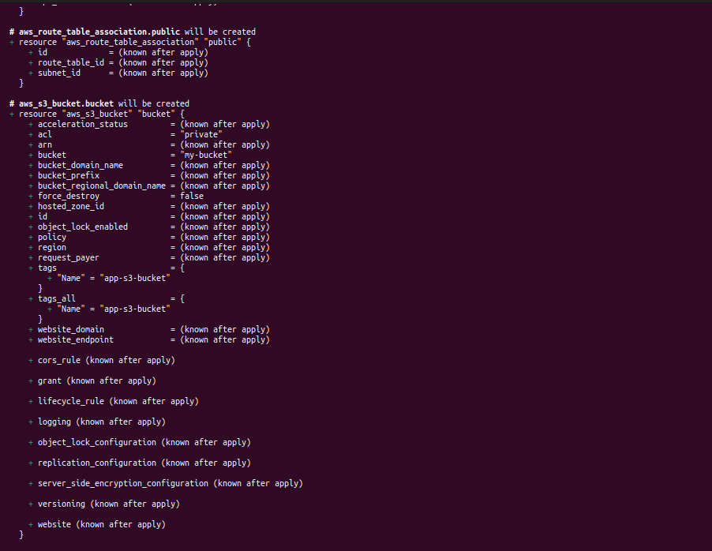

# Day-28
### Project Objective:

This project will test your ability to deploy a multi-tier architecture application using AWS CloudFormation. The deployment should include an EC2 instance, an S3 bucket, a MySQL DB instance in RDS, and a VPC, all within the specified constraints.

### Project Overview:

You are required to design and deploy a multi-tier application using AWS CloudFormation. The architecture will include the following components:

1. EC2 Instance: Serve as the web server.

2. S3 Bucket: Store static assets or configuration files.

3. RDS MySQL DB Instance: Serve as the database backend.
4. VPC: Ensure secure communication between the components.


#### Specifications:

* EC2 Instance: Use a t2.micro instance type, located in the public subnet, with SSH access allowed from a specific IP range.
* RDS MySQL DB Instance: Use a t3.micro instance type, located in a private subnet.
* S3 Bucket: Use for storing configuration files or assets for the web server.
* VPC: Create a VPC with public and private subnets. No NAT Gateway or Elastic IP should be used. Internet access for the EC2 instance should be provided via an Internet Gateway attached to the VPC.
* CloudFormation Template: Participants must create a CloudFormation template to automate the deployment process.
* Allowed Regions: Deployment is restricted to the regions us-east-1, us-east-2, us-west-1, and us-west-2.

#### Key Tasks:

1. Create a CloudFormation Template:
   * VPC and Subnets:

     * Define a VPC with one public and one private subnet.
     * Attach an Internet Gateway to the VPC for public subnet access.

   * Security Groups:
   * Create a security group for the EC2 instance, allowing SSH and HTTP access from a specific IP range.
   * Create a security group for the RDS instance, allowing MySQL access from the EC2 instance only.
   
   * EC2 Instance:
   * Launch a t2.micro EC2 instance in the public subnet.
   
   * Configure the instance to access the S3 bucket and connect to the RDS instance.
   * S3 Bucket:
   * Create an S3 bucket for storing static assets or configuration files.
   * Ensure the EC2 instance has the necessary IAM role and permissions to access the S3 bucket.
   * RDS MySQL DB Instance:
   * Launch a t3.micro MySQL database in the private subnet.
   * Configure the security group to allow access only from the EC2 instance.
2. Deploy the Application:

* Deploy the CloudFormation stack using the template created.
* Verify that all components are correctly configured and operational.
* Ensure the EC2 instance can communicate with the RDS instance and access the S3 bucket.

1. Testing:

* Test the deployed application by accessing it via the EC2 instance's public IP or DNS.
* Verify the connectivity between the EC2 instance and the RDS instance.
* Confirm that the EC2 instance can read from and write to the S3 bucket.

1. Documentation:

* Document the entire process, including the design decisions, the CloudFormation template, and the testing steps.
* Include screenshots or logs demonstrating the successful deployment and testing of the application.

1. Resource Termination:

* Once the deployment and testing are complete, terminate all resources by deleting the CloudFormation stack.
* Ensure that no resources, such as EC2 instances, RDS instances, or S3 buckets, are left running.
To Achive the following task:

Open AWS console go to the CloudFormation service click on the create stack:




Select the options as shown in above:
Upload the template file in yaml or json format:

```
AWSTemplateFormatVersion: '2010-09-09'
Description: Multi-Tier Architecture with EC2, S3, RDS, and VPC

Parameters:
  EnvironmentName:
    Description: An environment name that is prefixed to resource names
    Type: String

  VpcCIDR:
    Description: Please enter the IP range (CIDR notation) for this VPC
    Type: String
    Default: 10.192.0.0/16

  PublicSubnet1CIDR:
    Description: Please enter the IP range (CIDR notation) for the public subnet in the first Availability Zone
    Type: String
    Default: 10.192.10.0/24

  PublicSubnet2CIDR:
    Description: Please enter the IP range (CIDR notation) for the public subnet in the second Availability Zone
    Type: String
    Default: 10.192.11.0/24  

  PrivateSubnet1CIDR:
    Description: Please enter the IP range (CIDR notation) for the private subnet in the first Availability Zone
    Type: String
    Default: 10.192.20.0/24

  PrivateSubnet2CIDR:
    Description: Please enter the IP range (CIDR notation) for the private subnet in the second Availability Zone
    Type: String
    Default: 10.192.21.0/24

  InstanceType:
    Type: String
    Description: The instance type for the EC2 instance
    Default: t2.micro
    ConstraintDescription: Must be a valid EC2 instance type.

  ImageId:
    Type: String
    Description: The AMI ID for the EC2 instance
    Default: ami-04a81a99f5ec58529 
    ConstraintDescription: Must be a valid AMI ID in the region

  DBUsername:
    Type: String
    Description: The master username for the RDS instance
    Default: admin

  DBUserPassword:
    Type: String
    Description: The master password for the RDS instance
    NoEcho: true
    Default: password

  BucketName:
    Type: String
    Description: The name of the S3 bucket
    Default: Palash-bucket

Resources:
  # VPC
  MyVPC:
    Type: 'AWS::EC2::VPC'
    Properties:
      CidrBlock: !Ref VpcCIDR
      EnableDnsSupport: 'true'
      EnableDnsHostnames: 'true'
      Tags:
        - Key: Name
          Value: !Ref EnvironmentName


  # Public Subnet
  PublicSubnet:
    Type: 'AWS::EC2::Subnet'
    Properties:
      VpcId: !Ref MyVPC
      CidrBlock: !Ref PublicSubnet1CIDR
      AvailabilityZone: !Select [0, !GetAZs '']
      MapPublicIpOnLaunch: 'true'
      Tags:
        - Key: Name
          Value: PublicSubnet

  PublicSubnet2:
    Type: 'AWS::EC2::Subnet'
    Properties:
      VpcId: !Ref MyVPC
      CidrBlock: !Ref PublicSubnet2CIDR
      AvailabilityZone: !Select [1, !GetAZs '']
      MapPublicIpOnLaunch: 'true'
      Tags:
        - Key: Name
          Value: PublicSubnet2        

  # Private Subnet
  PrivateSubnet:
    Type: 'AWS::EC2::Subnet'
    Properties:
      VpcId: !Ref MyVPC
      CidrBlock: !Ref PrivateSubnet1CIDR
      AvailabilityZone: !Select [0, !GetAZs '']
      Tags:
        - Key: Name
          Value: PrivateSubnet

   # Private Subnet 2
  PrivateSubnet2:
    Type: 'AWS::EC2::Subnet'
    Properties:
      VpcId: !Ref MyVPC
      CidrBlock: !Ref  PrivateSubnet2CIDR
      AvailabilityZone: !Select [1, !GetAZs '']
      Tags:
        - Key: Name
          Value: PrivateSubnet2        

  # Internet Gateway
  InternetGateway:
    Type: 'AWS::EC2::InternetGateway'
    Properties:
      Tags:
        - Key: Name
          Value: MyInternetGateway

  # Attach Internet Gateway to VPC
  VPCGatewayAttachment:
    Type: 'AWS::EC2::VPCGatewayAttachment'
    Properties:
      VpcId: !Ref MyVPC
      InternetGatewayId: !Ref InternetGateway

  # Route Table for Public Subnet
  PublicRouteTable:
    Type: 'AWS::EC2::RouteTable'
    Properties:
      VpcId: !Ref MyVPC
      Tags:
        - Key: Name
          Value: PublicRouteTable

  # Route for Public Subnet to Internet
  PublicRoute:
    Type: 'AWS::EC2::Route'
    Properties:
      RouteTableId: !Ref PublicRouteTable
      DestinationCidrBlock: '0.0.0.0/0'
      GatewayId: !Ref InternetGateway

  # Associate Route Table with Public Subnet
  PublicSubnetRouteTableAssociation:
    Type: 'AWS::EC2::SubnetRouteTableAssociation'
    Properties:
      SubnetId: !Ref PublicSubnet
      RouteTableId: !Ref PublicRouteTable

  # Security Group for EC2
  EC2SecurityGroup:
    Type: 'AWS::EC2::SecurityGroup'
    Properties:
      GroupDescription: Allow SSH and HTTP access
      VpcId: !Ref MyVPC
      SecurityGroupIngress:
        - IpProtocol: 'tcp'
          FromPort: '22'
          ToPort: '22'
          CidrIp: '10.0.0.0/24'
        - IpProtocol: 'tcp'
          FromPort: '80'
          ToPort: '80'
          CidrIp: '0.0.0.0/0'

  # Security Group for RDS
  RDSecurityGroup:
    Type: 'AWS::EC2::SecurityGroup'
    Properties:
      GroupDescription: Allow MySQL access from EC2 instance
      VpcId: !Ref MyVPC
      SecurityGroupIngress:
        - IpProtocol: 'tcp'
          FromPort: '3306'
          ToPort: '3306'
          SourceSecurityGroupId: !Ref EC2SecurityGroup

  # EC2 Instance
  WebServerInstance:
    Type: 'AWS::EC2::Instance'
    Properties:
      InstanceType: !Ref InstanceType
      ImageId: !Ref ImageId
      SubnetId: !Ref PublicSubnet
      SecurityGroupIds:
        - !Ref EC2SecurityGroup
      IamInstanceProfile: !Ref EC2InstanceProfile

  # IAM Role for EC2 to access S3
  EC2InstanceRole:
    Type: 'AWS::IAM::Role'
    Properties:
      AssumeRolePolicyDocument:
        Version: '2012-10-17'
        Statement:
          - Effect: 'Allow'
            Principal:
              Service: 'ec2.amazonaws.com'
            Action: 'sts:AssumeRole'
      Policies:
        - PolicyName: 'S3AccessPolicy'
          PolicyDocument:
            Version: '2012-10-17'
            Statement:
              - Effect: 'Allow'
                Action:
                  - 's3:GetObject'
                  - 's3:PutObject'
                Resource: 'arn:aws:s3:::Palash-bucket/*'

  # IAM Instance Profile
  EC2InstanceProfile:
    Type: 'AWS::IAM::InstanceProfile'
    Properties:
      Roles:
        - !Ref EC2InstanceRole

  # S3 Bucket
  ConfigBucket:
    Type: 'AWS::S3::Bucket'
    Properties:
      BucketName: !Ref BucketName

  # RDS DB Instance
  MySQLDBInstance:
    Type: 'AWS::RDS::DBInstance'
    Properties:
      DBInstanceClass: 'db.t3.micro'
      Engine: 'mysql'
      MasterUsername: !Ref DBUsername
      MasterUserPassword: !Ref DBUserPassword 
      DBName: 'mydatabase'
      VPCSecurityGroups:
        - !Ref RDSecurityGroup
      DBSubnetGroupName: !Ref RDSSubnetGroup
      PubliclyAccessible: 'false'
      AllocatedStorage: '20'

  # RDS Subnet Group
  RDSSubnetGroup:
    Type: 'AWS::RDS::DBSubnetGroup'
    Properties:
      DBSubnetGroupDescription: 'Subnet group for RDS'
      SubnetIds:
        - !Ref PrivateSubnet
        - !Ref PrivateSubnet2  
      Tags:
        - Key: Name
          Value: RDSSubnetGroup

Outputs:
  EC2InstanceID:
    Description: 'ID of the EC2 instance'
    Value: !Ref WebServerInstance
  S3BucketName:
    Description: 'Name of the S3 bucket'
    Value: !Ref ConfigBucket
  RDSInstanceEndpoint:
    Description: 'Endpoint of the RDS MySQL instance'
    Value: !GetAtt MySQLDBInstance.Endpoint.Address
  RDSInstancePort:
    Description: 'Port of the RDS MySQL instance'
    Value: !GetAtt MySQLDBInstance.Endpoint.Port

```

