# Docker Project 01
### Part 1: Creating a Container from a Pulled Image

-   Pull the official Nginx image from Docker Hub
```
docker pull nginx
```

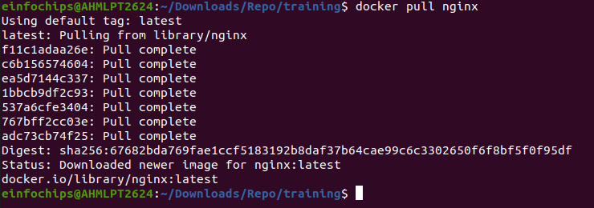

-   Run the Nginx Container:

```
docker run --name my-nginx -d -p 8080:80 nginx
```
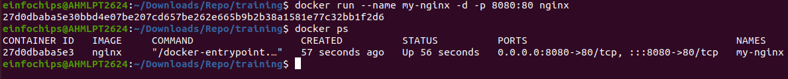

-   Visit http://localhost:8080 in your browser. You should see the Nginx welcome page.

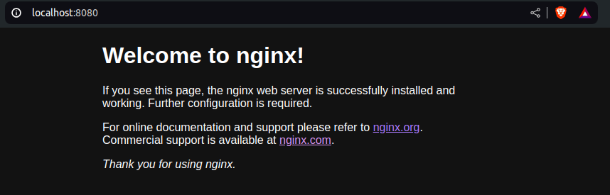

### Part 2: Modifying the Container and Creating a New Image

-   Access the Running Container:
```
docker exec -it my-nginx /bin/bash
```
-   Create a Custom HTML Page:

```
echo "<html><body><h1>Hello from Docker!</h1></body></html>" > /usr/share/nginx/html/index.html
```
-   Exit the Container:
```
exit
```

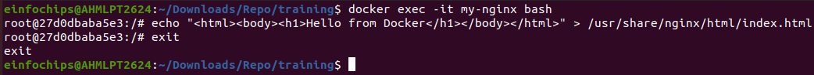

-   Commit the Changes to Create a New Image:
```
docker commit my-nginx custom-nginx
```

-   Run a Container from the New Image:
```
docker run --name my-custom-nginx -d -p 8081:80 custom-nginx
```

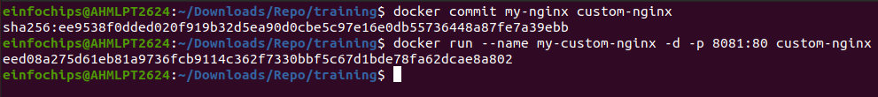

-   Visit http://localhost:8081 in your browser. You should see your custom HTML page.

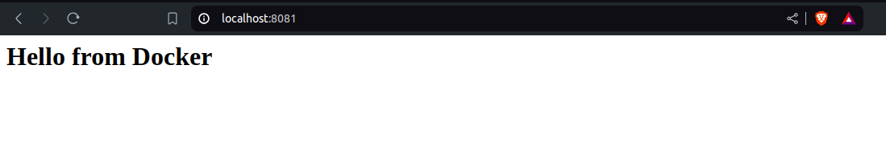

### Part 3: Creating a Dockerfile to Build and Deploy a Web Application

-   Create a Project Directory:

```
mkdir my-webapp
cd my-webapp
```
-   Create a Simple Web Application:

```
<!DOCTYPE html>
<html>
<body>
    <h1>Hello from My Web App!</h1>
</body>
</html>
```
-   Save this file in the my-webapp directory.
-   Write the Dockerfile:
Create a Dockerfile in the my-webapp directory with the following content:

```
# Use the official Nginx base image
FROM nginx:latest

# Copy the custom HTML file to the appropriate location
COPY index.html /usr/share/nginx/html/

# Expose port 80
EXPOSE 80
```

-   Build the Docker Image:
```
docker build -t my-webapp-image .
```
-   Run a Container from the Built Image:
```
docker run --name my-webapp-container -d -p 8082:80 my-webapp-image
```
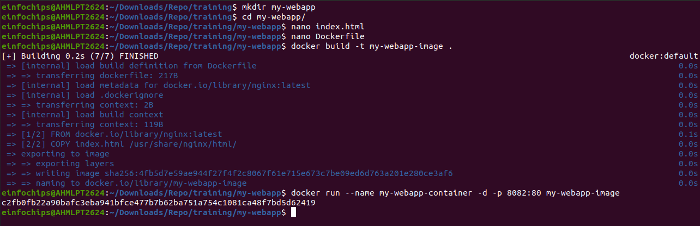

-   Verify the Web Application:
Visit http://localhost:8082 in your browser. You should see your custom web application.

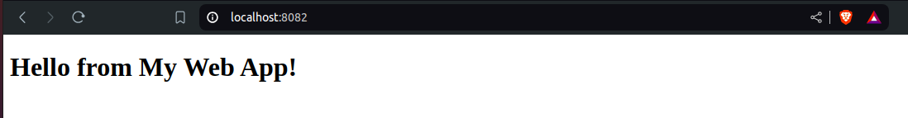

# Docker Project 02

### Part 1: Setting Up the Project Structure

-   Create the Project Directory:
```
mkdir fullstack-docker-app
cd fullstack-docker-app
```
-   Create Subdirectories for Each Service:
```
mkdir frontend backend database
```

-   Create Shared Network and Volume:
```
docker network create fullstack-network
```
-   Create a volume for the PostgreSQL database.
```
docker volume create pgdata
```
### Part 2: Setting Up the Database
Create a Dockerfile for PostgreSQL:
```
FROM postgres:latest
ENV POSTGRES_USER=user
ENV POSTGRES_PASSWORD=password
ENV POSTGRES_DB=mydatabase
```

Build the PostgreSQL Image:
```
cd database
```
```
docker build -t my-postgres-db .
```
```
cd ..
```
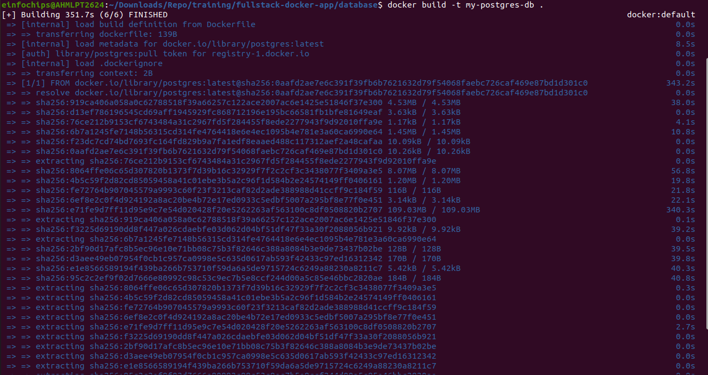

-   Run the PostgreSQL Container:
```
docker run --name postgres-container --network fullstack-network -v pgdata:/var/lib/postgresql/data -d my-postgres-db
```
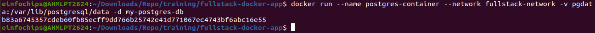

### Part 3: Setting Up the Backend (Node.js with Express)

-   Create a Node.js application with Express and set it up with Docker.

-   Initialize the Node.js Application:
```
cd backend
npm init -y
```
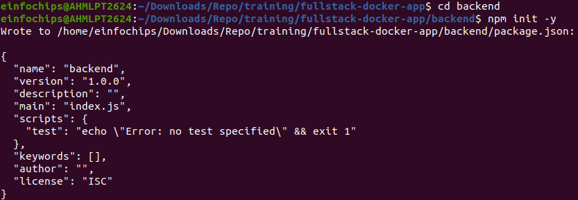

-   Install Express and pg (PostgreSQL client for Node.js):
```
npm install express pg
```
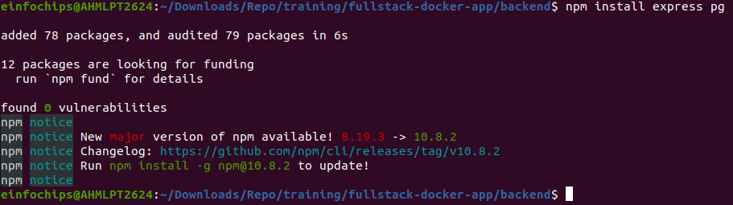

-   In the backend directory, create a file named index.js with the following content:

```
const express = require('express');
const { Pool } = require('pg');
const app = express();
const port = 3000;

const pool = new Pool({
    user: 'user',
    host: 'postgres-container',
    database: 'mydatabase',
    password: 'password',
    port: 5432,
});

app.get('/', (req, res) => {
    res.send('Hello from Node.js and Docker!');
});

app.get('/data', async (req, res) => {
    const client = await pool.connect();
    const result = await client.query('SELECT NOW()');
    client.release();
    res.send(result.rows);
});

app.listen(port, () => {
    console.log(`App running on http://localhost:${port}`);
});
```
-   In the backend directory, create a file named Dockerfile with the following content:

```
FROM node:latest

WORKDIR /usr/src/app

COPY package*.json ./
RUN npm install

COPY . .

EXPOSE 3000
CMD ["node", "index.js"]
```
-   Build the Backend Image:
```
docker build -t my-node-app .
cd ..
```

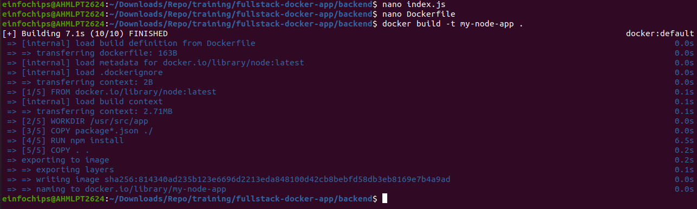

-   Run the Backend Container:
```
docker run --name backend-container --network fullstack-network -d my-node-app
```
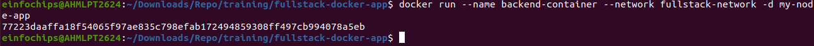

### Part 4: Setting Up the Frontend (Nginx)

-    In the frontend directory, create a file named index.html with the following content:

```
<!DOCTYPE html>
<html>
<body>
    <h1>Hello from Nginx and Docker!</h1>
    <p>This is a simple static front-end served by Nginx.</p>
</body>
</html>
```

-   In the frontend directory, create a file named Dockerfile with the following content:

```
FROM nginx:latest
COPY index.html /usr/share/nginx/html/index.html
```
-   Build the Frontend Image:
```
cd frontend
docker build -t my-nginx-app .
cd ..
```
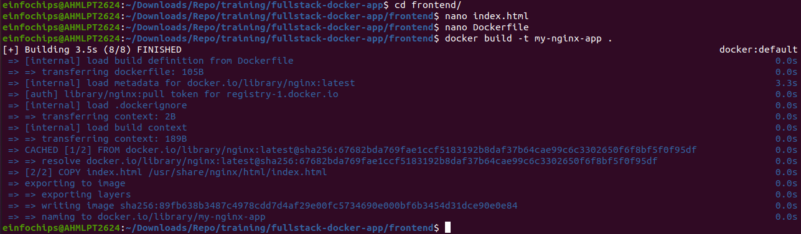

-   Run the Frontend Container:
```
docker run --name frontend-container --network fullstack-network -p 8080:80 -d my-nginx-app
```

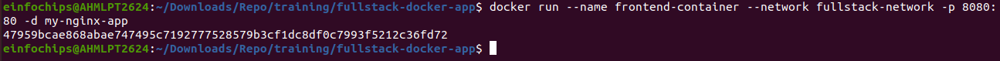

### Part 5: Connecting the Backend and Database
-   Update Backend Code to Fetch Data from PostgreSQL:

-   Access the backend container:
```
docker exec -it backend-container /bin/bash
```
-   Test the connection to the database using psql:
```
apt-get update && apt-get install -y postgresql-client
psql -h postgres-container -U user -d mydatabase -c "SELECT NOW();"
```
-   Exit the container:
```
exit
```
-   Test the Backend API:
Visit http://localhost:3000 to see the basic message.
-   Visit http://localhost:3000/data to see the current date and time fetched from PostgreSQL.
### Part 6: Final Integration and Testing
-   Access the Frontend:
Visit http://localhost:8080 in your browser. 
-   Verify Full Integration:
Update the index.html to include a link to the backend:

```
<!DOCTYPE html>
<html>
<body>
    <h1>Hello from Nginx and Docker!</h1>
    <p>This is a simple static front-end served by Nginx.</p>
    <a href="http://localhost:3000/data">Fetch Data from Backend</a>
</body>
</html>
```

Rebuild and Run the Updated Frontend Container:
```
cd frontend
```
```
docker build -t my-nginx-app .
```
```
docker stop frontend-container
```
```
docker rm frontend-container
```
```
docker run --name frontend-container --network fullstack-network -p 8080:80 -d my-nginx-app
```
```
cd ..
```
-   Visit http://localhost:8080 and click the link to fetch data from the backend.

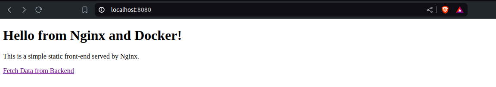

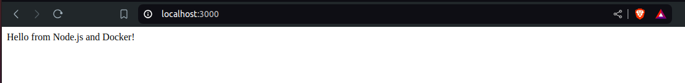

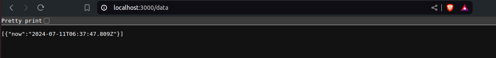
