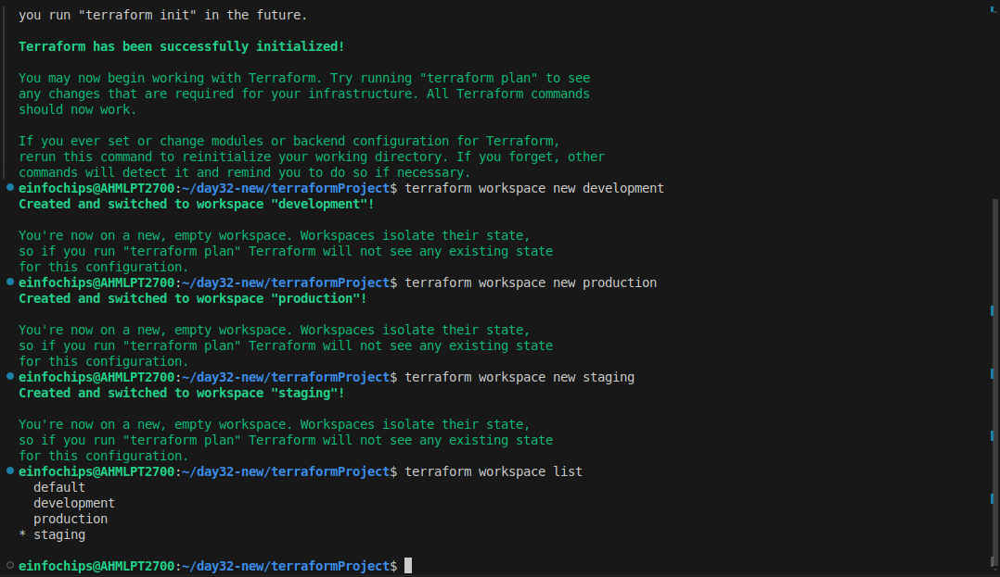
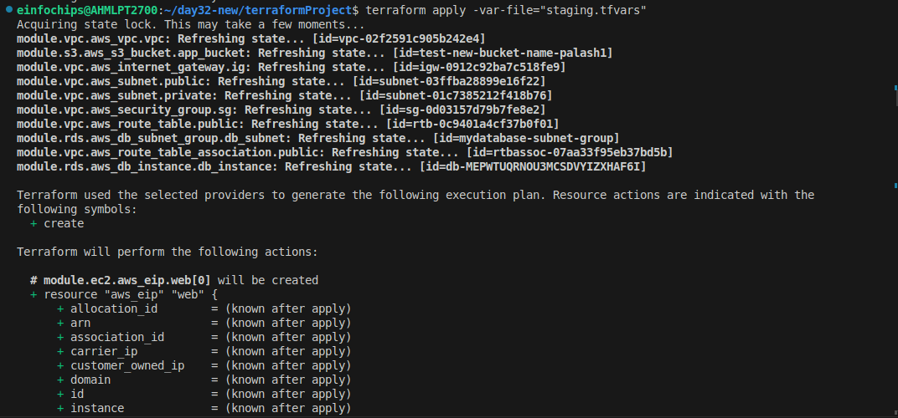
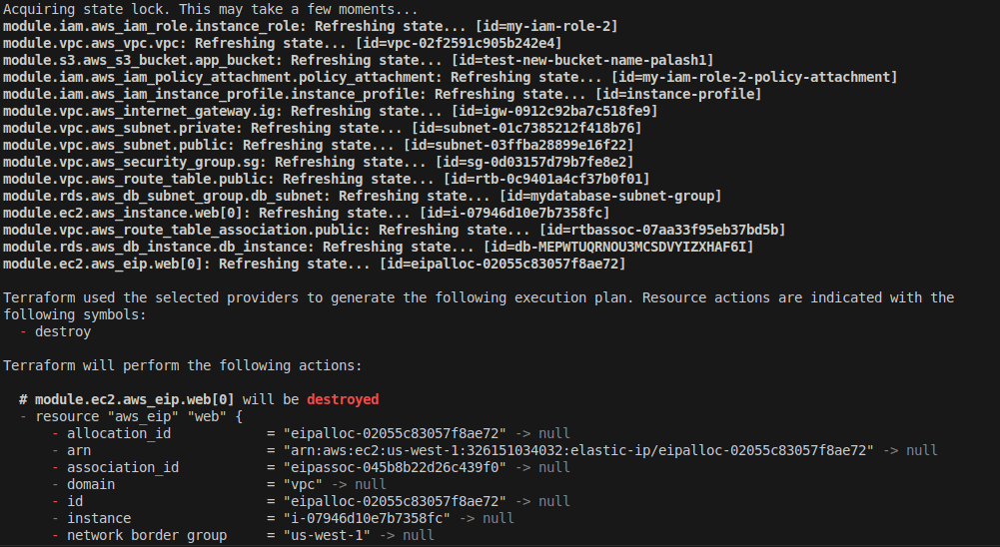

# Day 30 Task
**Project: Advanced Terraform with Provisioners, Modules, and Workspaces**

 - **Project Objective:**
This project is designed to evaluate participants' understanding of Terraform provisioners, modules, and workspaces. The project involves deploying a basic infrastructure on AWS using Terraform modules, executing remote commands on the provisioned resources using provisioners, and managing multiple environments using Terraform workspaces. All resources should be within the AWS Free Tier limits.

 - **Project Overview:**
Participants will create a Terraform configuration that deploys an EC2 instance and an S3 bucket using a custom Terraform module. The project will also require the use of Terraform provisioners to execute scripts on the EC2 instance. Finally, participants will manage separate environments (e.g., dev and prod) using Terraform workspaces.

## Key Tasks:

### Module Development:
 - **Module Setup:** Create a directory for the module (e.g., modules).


 - **Resource Definitions:** Define the resources for an EC2 instance and an S3 bucket within the module.
 

 - **Variable Inputs:** Define input variables for instance type, AMI ID, key pair name, and S3 bucket name.
 

 - **Outputs:** Define outputs for the EC2 instance's public IP and the S3 bucket's ARN.


### Main Terraform Configuration:
 - **Main Config Setup:** In the root directory, create a Terraform configuration that calls the custom module.


 - **Backend Configuration:** Configure Terraform to use local state storage for simplicity (optional for Free Tier compliance).


### Provisioner Implementation:
 - **Remote Execution:** Use the remote-exec provisioner to SSH into the EC2 instance and execute a script that installs Apache.

```hcl
provisioner "remote-exec" {
  inline = [
  "sudo apt-get update -y",
  "sudo apt-get install -y apache2",
  "sudo systemctl start apache2",
  "sudo systemctl enable apache2"
  ]

  connection {
    type        = "ssh"
    user        = "ubuntu"
    private_key = file(var.private_key_path)
    host        = self.public_ip
  }
}
```

 - **Local Execution:** Use the local-exec provisioner to print a confirmation message on the local machine after successful deployment.
```hcl
provisioner "local-exec" {
  command = "echo 'EC2 instance successfully provisioned with Apache.'"
}
```

### Workspace Management:
 - **Workspace Creation:** Create Terraform workspaces for dev and prod.


### Validation and Testing:
 - **Apache Installation Verification:** After the deployment, verify that Apache is installed and running on the EC2 instance by accessing the public IP address in a web browser.

**Dev Workspace Apache Instance**
 

**Prod Workspace Apache Instance**


 - **Workspace Separation:** Confirm that each workspace has its own isolated infrastructure and state files.
 - Provisioner Logs: Review the output from the local-exec provisioner to ensure it indicates successful deployment.


### Resource Cleanup:
 - **Destroy Resources:** Use terraform destroy to remove the resources in both workspaces.
 - **Workspace Management:** Confirm that the resources are destroyed separately in each workspace and that the state files are updated accordingly.

**Resources Destroyed for both Workspaces**








