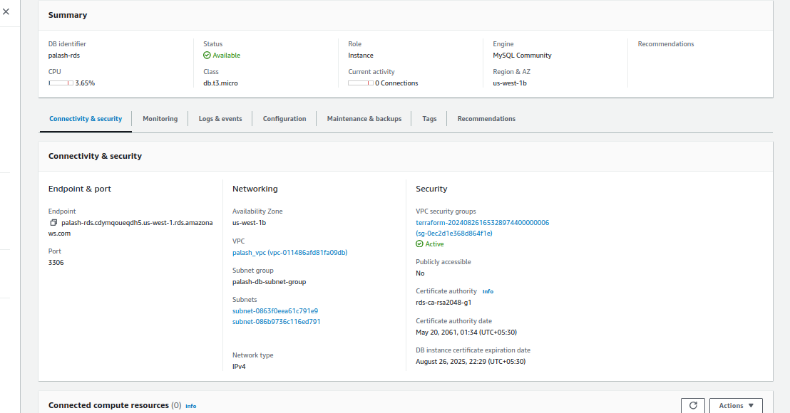
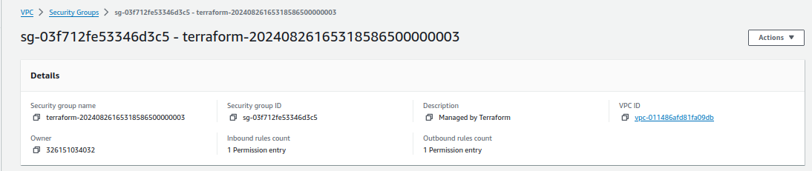

# Project: Automation (IaaC) Terraform on AWS Assessment Project

## Project Overview

+ This capstone project is designed to assess participants' knowledge and practical skills with Terraform, specifically focusing on AWS. The project will require deploying a complete infrastructure using Terraform, emphasizing the usage of state lock, variables, .tfvars files, modules, functions, workspaces, and lifecycle rules. 

+ The deployment will be restricted to AWS Free Tier resources to avoid unnecessary costs.

## Project Objectives

+ Deploy a multi-tier architecture on AWS using Terraform.
+ Implement state locking to manage concurrent changes.
+ Use variables and .tfvars files to parameterize configurations.
+ Create and use Terraform modules to promote reusability and organization.
+ Utilize functions to dynamically configure resources.
+ Manage multiple environments using Terraform workspaces.
+ Implement lifecycle rules to control resource creation, updates, and deletion.

## Project Requirements

### 1. Infrastructure Design

+ The project will involve deploying a basic 3-tier web application architecture, which includes the following components:

1. VPC: Create a Virtual Private Cloud (VPC) with public and private subnets across two availability zones.
2. Security Groups: Define security groups to control inbound and outbound traffic for the application and database tiers.
3. EC2 Instances: Deploy EC2 instances in the public subnets for the web servers (Application Tier).
4. RDS Instance: Deploy an RDS MySQL instance in the private subnet for the database (Database Tier).
5. S3 Bucket: Create an S3 bucket to store static files, with versioning enabled.
6. Elastic IPs: Assign Elastic IPs to the EC2 instances.
7. IAM Role: Create an IAM role with the necessary permissions and attach it to the EC2 instances.

### 2. Terraform State Management

+  Implement remote state storage using an S3 bucket to store the Terraform state file.
+  Use DynamoDB for state locking to prevent concurrent modifications.

### 3. Variables and tfvars


+ Define input variables for resources like VPC CIDR, instance types, database username/password, and S3 bucket names.
+ Use .tfvars files to pass different configurations for environments (e.g., dev.tfvars, prod.tfvars).

### 4. Modules

+ Break down the infrastructure into reusable modules:
    
    + VPC Module: Manage VPC, subnets, and routing tables.
    + EC2 Module: Configure and launch EC2 instances.
    + RDS Module: Set up the RDS MySQL database.
    + S3 Module: Handle S3 bucket creation with versioning.
    + IAM Module: Create and manage IAM roles and policies.

### 5. Functions
+ Use Terraform functions to dynamically configure:
    
    + The names of resources using format and join functions.
    + Subnet CIDRs using cidrsubnet.
    + Lookup values for AMI IDs using lookup function.

### 6. Workspaces

+  Create workspaces for different environments (e.g., development, staging, production).
+  Deploy the infrastructure in each environment using the appropriate workspace.

### 7. Lifecycle Rules

+ Implement lifecycle rules to:
    + Prevent resource deletion: Ensure certain resources, like the RDS database, are not accidentally deleted (prevent_destroy).
    + Ignore changes to specific resource attributes (e.g., S3 bucket tags) using ignore_changes.

### Project Steps

#### Step 1: Setup Remote State and Locking

1. Create an S3 bucket for storing Terraform state.
2. Create a DynamoDB table for state locking.
3. Configure the backend in Terraform to use the S3 bucket and DynamoDB table.

#### Step 2: Develop and Organize Modules

1. Develop separate modules for VPC, EC2, RDS, S3, and IAM.
2. Place each module in a separate directory with main.tf, variables.tf, and outputs.tf.


#### Step 3: Define Variables and tfvars Files

1. Define variables in variables.tf files within each module.


2. Create a terraform.tfvars file with default values.


3. Create separate environment-specific .tfvars files (e.g., dev.tfvars, prod.tfvars).


#### Step 4: Implement Workspaces

-   Initialize Terraform and create workspaces (development, staging, production).

```sh
terraform workspace new development
terraform workspace new production
terraform workspace new staging
```


#### Step 5: Deploy the Infrastructure

-   Use the terraform apply command to deploy the infrastructure in each workspace.





#### Step 6: Cleanup

1. Destroy the infrastructure in each workspace using terraform destroy.

2. Ensure that resources marked with prevent_destroy are not deleted.



