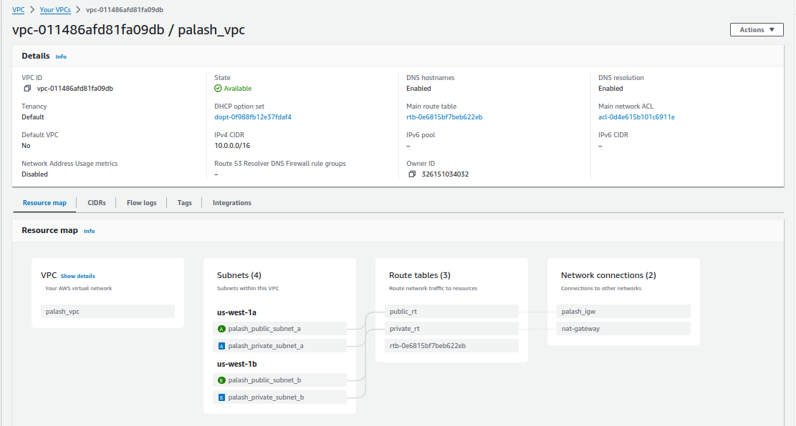
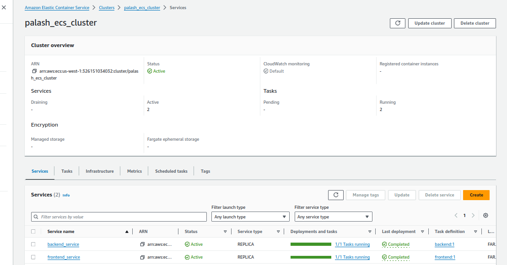
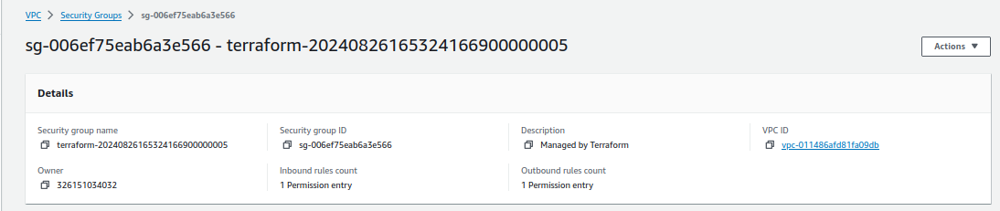

# Day-33 Task
## Project Overview: Deploying a Multi-Tier Web Application Using Amazon ECS (Without Load Balancer and API Gateway)
This project is designed to test participants' knowledge of Amazon ECS (Elastic Container Service) by deploying a multi-tier web application on AWS without using a Load Balancer or API Gateway. The project involves setting up an ECS cluster, defining task definitions, creating services, and ensuring proper networking and security configurations using VPC, subnets, security groups, and IAM roles.

### Project Objectives:
- Set up an ECS Cluster using the Fargate launch type.
- Deploy a web application consisting of multiple containers (frontend and backend).
- Implement direct communication between frontend and backend services.
- Manage ECS tasks, services, and scaling policies.
- Ensure network security with VPC, subnets, security groups, and IAM roles.

### Project Requirements:
- ECS Cluster: Create an ECS Cluster using Fargate.
- Task Definitions: Define task definitions for web and backend services.
- Services: Create ECS services for each tier (frontend and backend) without using a Load Balancer or API Gateway.
- Security Groups: Configure security groups to allow traffic between services directly.
- IAM Roles: Create and assign IAM roles for ECS tasks.
- VPC and Networking: Create a VPC with public and private subnets, ensuring proper routing of traffic without a NAT gateway.
- Secrets Management: Use AWS Secrets Manager or SSM Parameter Store to manage database credentials.
- Scaling: Implement auto-scaling policies for the ECS services.
### Deployment and Validation

- Deploy the multi-tier web application using the ECS services.
- Validate the communication between the frontend and backend services.
- Test the application to ensure it functions as expected.
- Monitor the application’s performance using CloudWatch and other AWS monitoring tools.
1. **Initialize Terraform**

    ```
    terraform init
    ```

  

2. **Apply Configuration**

    ```
    terraform apply
    ```


- VPC



- NAT gateway


- RDS


- ECS Cluster




- Security Groups




- Elastic IP


- Frontend Page


### Resource Cleanup
Once the deployment is validated, ensure that all AWS resources are properly terminated

```
terraform destroy
```


   

 

    


