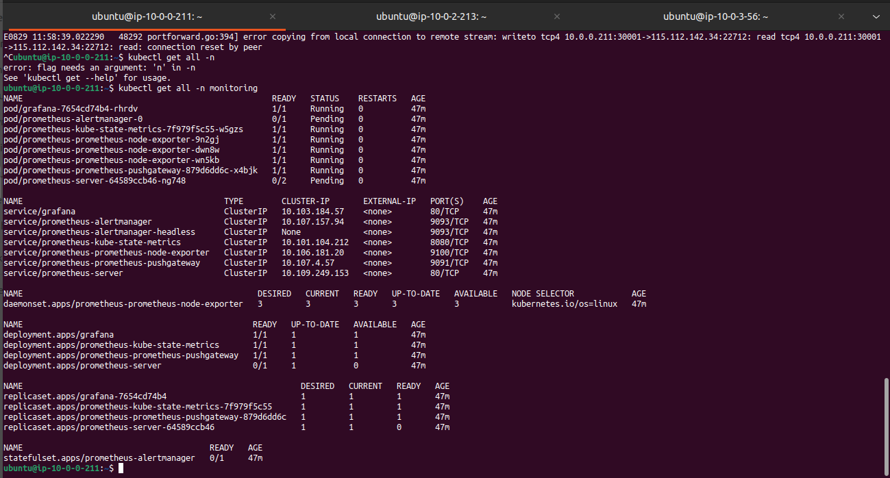

# Day-36 Task
## Project: Monitoring Kubernetes Applications Using Prometheus and Grafana on EC2 Instances

### 1. Launch AWS EC2 Instances
-   Launch three EC2 instances of type t2.micro in the same VPC and availability zone.


-   Configure security groups to allow SSH access (port 22) and necessary ports for Kubernetes, Prometheus, and Grafana (e.g., ports 9090, 3000).
-   SSH into the instances and update the package manager.
```
ssh -i <key-pair> ubuntu@<instance-ip>
```

### 2. Set Up a Kubernetes Cluster
-   On the master node, install Kubeadm, Kubelet, and Kubectl.
-   Initialize the Kubernetes cluster using Kubeadm.


### 3. Deploy Prometheus on Kubernetes 
-   Create a Kubernetes namespace for monitoring tools.
```
kubectl create namespace monitoring
```
-   Use a Helm chart to deploy Prometheus or manually deploy Prometheus using Kubernetes manifests.
```
helm repo add prometheus-community https://prometheus-community.github.io/helm-charts
```


```
helm install prometheus prometheus-community/prometheus --namespace monitoring
```


### 4. Deploy Grafana on Kubernetes (20 Minutes)
-   Deploy Grafana in the monitoring namespace.
```
helm repo add grafana https://grafana.github.io/helm-charts
```

```
helm install grafana grafana/grafana --namespace monitoring
```




-   Expose Grafana using a Kubernetes service and set up port forwarding or a LoadBalancer for external access.
```
kubectl get secret --namespace monitoring grafana -o jsonpath="{.data.admin-password}" | base64 --decode ; echo
```
```
kubectl port-forward service/grafana --address 0.0.0.0 30001:80 --namespace monitoring
```


