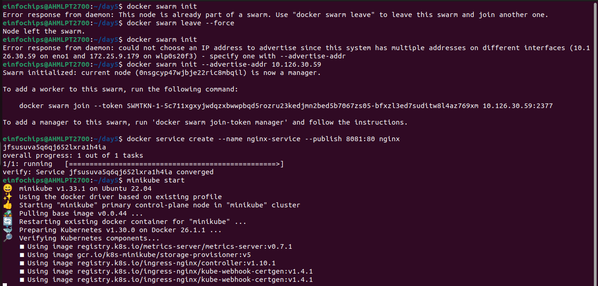
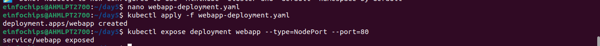
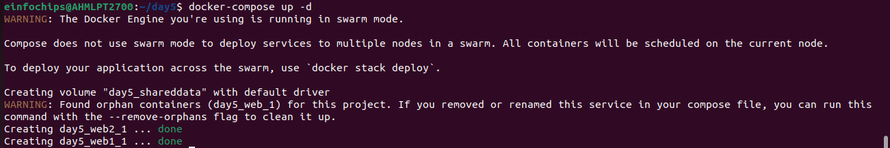
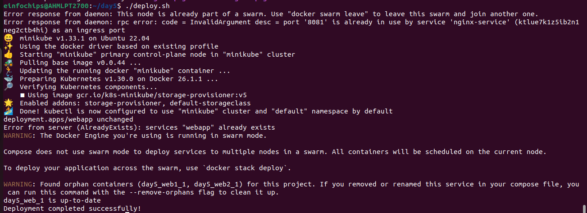
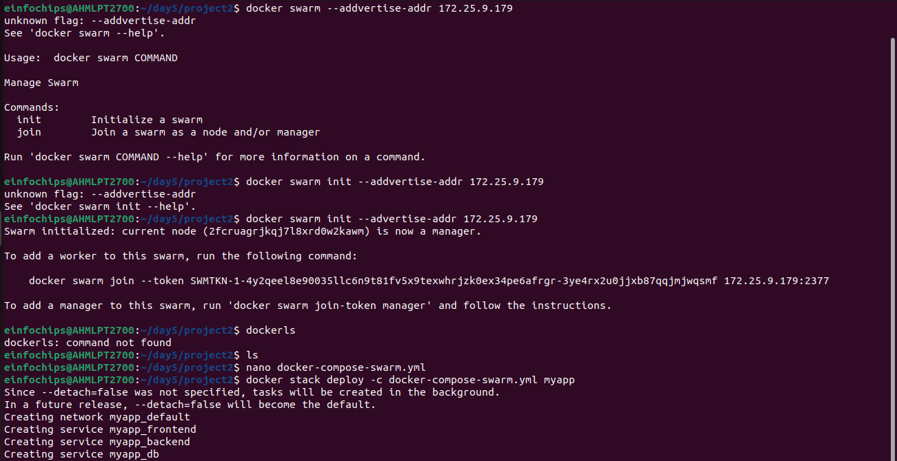
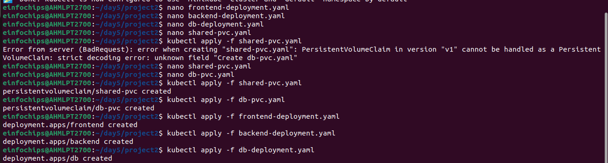

# day5 
## Project-1 Deploying a Scalable Web Application with Persistent Storage and Advanced Automation

### Step 1: Set up Docker Swarm and Create a Service
-   Initialize Docker Swarm
```
docker swarm init
```
-   Create a simple Nginx service in Docker Swarm
```
docker service create --name nginx-service --publish 8080:80 nginx
```

### Step 2: Set up Kubernetes Using Minikube

-   Start Minikube
```
minikube start
```


-   Create a deployment file named webapp-deployment.yaml:

```
apiVersion: apps/v1
kind: Deployment
metadata:
  name: webapp
spec:
  replicas: 3
  selector:
    matchLabels:
      app: webapp
  template:
    metadata:
      labels:
        app: webapp
    spec:
      containers:
      - name: webapp
        image: nginx
        ports:
        - containerPort: 80
```
-   Apply the deployment:
```
kubectl apply -f webapp-deployment.yaml
```
-   Expose the Deployment
```
kubectl expose deployment webapp --type=NodePort --port=80
```



-    Create a docker-compose.yml File
```
version: '3'
services:
  web:
    image: nginx
    ports:
      - "8080:80"
    volumes:
      - webdata:/usr/share/nginx/html

volumes:
  webdata:
```
-   Deploy using Docker Compose
```
docker-compose up -d
```



### Step 4: Use a Single Shared Volume Across Multiple Containers
-   Update docker-compose.yml to Use a Shared Volume
```
version: '3'
services:
  web1:
    image: nginx
    ports:
      - "8081:80"
    volumes:
      - shareddata:/usr/share/nginx/html
  web2:
    image: nginx
    ports:
      - "8082:80"
    volumes:
      - shareddata:/usr/share/nginx/html

volumes:
  shareddata:
```

-   Deploy using Docker Compose
```
docker-compose up -d
```
### Step 5: Automate the Entire Process Using Advanced Shell Scriptin

-   Create a Shell Script deploy.sh
```
#!/bin/bash

# Initialize Docker Swarm
docker swarm init

# Create Docker Swarm Service
docker service create --name nginx-service --publish 8080:80 nginx

# Start Minikube
minikube start

# Create Kubernetes Deployment
kubectl apply -f webapp-deployment.yaml

# Expose the Deployment
kubectl expose deployment webapp --type=NodePort --port=80

# Deploy Web App Using Docker Compose
docker-compose -f docker-compose-single-volume.yml up -d

echo "Deployment completed successfully!"
```
-   Make the script executable
```
chmod +x deploy.sh
```
-   Run the deployment script
```
./deploy.sh
```




## Project-2 Comprehensive Deployment of a Multi-Tier Application with CI/CD Pipeline

-   Initialize Docker Swarm
```
docker swarm init
```
-   Create a docker-compose-swarm.yml file:
```
version: '3.7'
services:
  frontend:
    image: nginx
    ports:
      - "8080:80"
    deploy:
      replicas: 2
    volumes:
      - shareddata:/usr/share/nginx/html
  backend:
    image: mybackendimage
    ports:
      - "8081:80"
    deploy:
      replicas: 2
    volumes:
      - shareddata:/app/data
  db:
    image: postgres
    environment:
      POSTGRES_DB: mydb
      POSTGRES_USER: user
      POSTGRES_PASSWORD: password
    deploy:
      replicas: 1
    volumes:
      - dbdata:/var/lib/postgresql/data

volumes:
  shareddata:
  dbdata:
```
-   Deploy the stack using Docker Swarm
```
docker stack deploy -c docker-compose-swarm.yml myapp
```


### Step 2: Set up Kubernetes Using Minikube

-   Start Minikube
```
minikube start
```
-   Create frontend-deployment.yaml:
```
apiVersion: apps/v1
kind: Deployment
metadata:
  name: frontend
spec:
  replicas: 2
  selector:
    matchLabels:
      app: frontend
  template:
    metadata:
      labels:
        app: frontend
    spec:
      containers:
      - name: frontend
        image: nginx
        ports:
        - containerPort: 80
        volumeMounts:
        - name: shareddata
          mountPath: /usr/share/nginx/html
      volumes:
      - name: shareddata
        persistentVolumeClaim:
          claimName: shared-pvc
```

-   Create backend-deployment.yaml:
```
apiVersion: apps/v1
kind: Deployment
metadata:
  name: backend
spec:
  replicas: 2
  selector:
    matchLabels:
      app: backend
  template:
    metadata:
      labels:
        app: backend
    spec:
      containers:
      - name: backend
        image: mybackendimage
        ports:
        - containerPort: 80
        volumeMounts:
        - name: shareddata
          mountPath: /app/data
      volumes:
      - name: shareddata
        persistentVolumeClaim:
          claimName: shared-pvc
```

-   Create db-deployment.yaml:
```
apiVersion: apps/v1
kind: Deployment
metadata:
  name: db
spec:
  replicas: 1
  selector:
    matchLabels:
      app: db
  template:
    metadata:
      labels:
        app: db
    spec:
      containers:
      - name: db
        image: postgres
        env:
        - name: POSTGRES_DB
          value: mydb
        - name: POSTGRES_USER
          value: user
        - name: POSTGRES_PASSWORD
          value: password
        volumeMounts:
        - name: dbdata
          mountPath: /var/lib/postgresql/data
      volumes:
      - name: dbdata
        persistentVolumeClaim:
          claimName: db-pvc
```

-   Create shared-pvc.yaml:
```
apiVersion: v1
kind: PersistentVolumeClaim
metadata:
  name: shared-pvc
spec:
  accessModes:
  - ReadWriteMany
  resources:
    requests:
      storage: 1Gi
```

-   Create db-pvc.yaml:
```
apiVersion: v1
kind: PersistentVolumeClaim
metadata:
  name: db-pvc
spec:
  accessModes:
  - ReadWriteOnce
  resources:
    requests:
      storage: 1Gi
```

-   Apply the deployments:
```
kubectl apply -f shared-pvc.yaml
kubectl apply -f db-pvc.yaml
kubectl apply -f frontend-deployment.yaml
kubectl apply -f backend-deployment.yaml
kubectl apply -f db-deployment.yaml
```



### Step 3: Deploy a Multi-Tier Application Using Docker Compose

-   Create a docker-compose.yml File
```
version: '3'
services:
  frontend:
    image: nginx
    ports:
      - "8080:80"
    volumes:
      - shareddata:/usr/share/nginx/html
  backend:
    image: mybackendimage
    ports:
      - "8081:80"
    volumes:
      - shareddata:/app/data
  db:
    image: postgres
    environment:
      POSTGRES_DB: mydb
      POSTGRES_USER: user
      POSTGRES_PASSWORD: password
    volumes:
      - dbdata:/var/lib/postgresql/data

volumes:
  shareddata:
  dbdata:
```
-   Deploy using Docker Compose
```
docker-compose up -d
```

