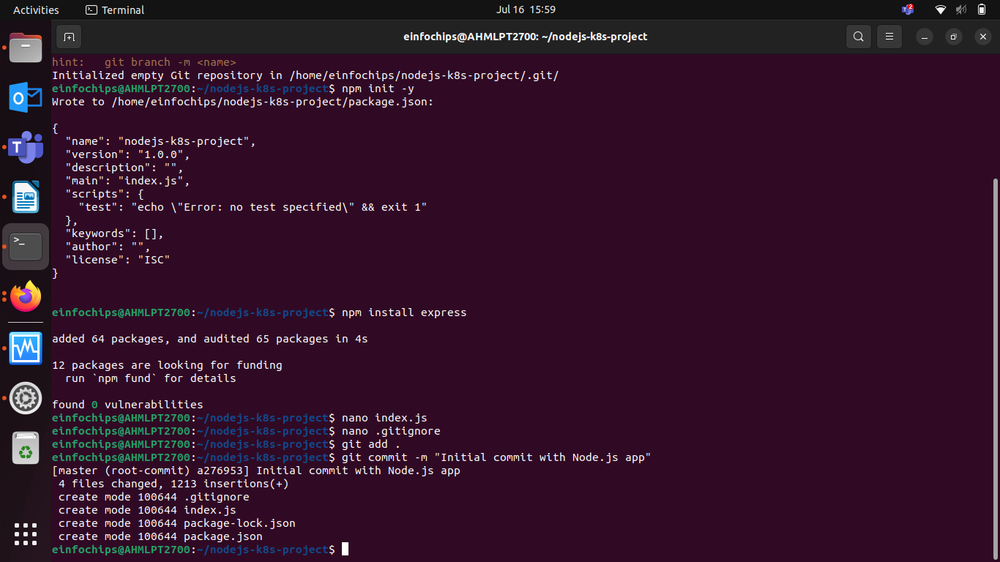

# Project 01 Deploying a Node.js App Using Minikube Kubernetes

-   Create a new directory for your project:
```
mkdir nodejs-k8s-project
cd nodejs-k8s-project
```
Initialize a Git repository:
```
git init
```

-   Initialize a Node.js project:
```
npm init -y
```
-   Install Express.js:
```
npm install express
```

-   Create an index.js file with the following content:
```
const express = require('express');
const app = express();
const port = 3000;

app.get('/', (req, res) => {
    res.send('Hello, Kubernetes!');
});

app.listen(port, () => {
    console.log(`App running at http://localhost:${port}`);
});
```

-   Create a .gitignore file to ignore node_modules:
```
node_modules
```
-   Commit the Initial Code
Add files to Git:
```
git add .
```
-   Commit the changes:
```
git commit -m "Initial commit with Node.js app"
```


-   Create a New Branch
Create and switch to a new branch feature/add-route:
```
git checkout -b feature/add-route
```
-   Implement a New Route
Modify index.js to add a new route:
```
app.get('/newroute', (req, res) => {
    res.send('This is a new route!');
});
```
-   Commit the changes:
```
git add .
git commit -m "Add new route"
```

-   Merge the Branch Using Fast-Forward
Switch back to the main branch:
```
git merge --ff-only feature/add-route
```
Delete the feature branch:
```
git branch -d feature/add-route
```

-   Containerize the Node.js Application
-   Create a Dockerfile

```
FROM node:14
WORKDIR /app
COPY package*.json ./
RUN npm install
COPY . .
EXPOSE 3000
CMD ["node", "index.js"]
```
-   Build the Docker image:
```
docker build -t nodejs-k8s-app .
```


-   Run the Docker container to test:
```
docker run -p 3000:3000 nodejs-k8s-app
```


-   Access http://localhost:3000 to see the app running.


-   Deploying to Minikube Kubernetes
-   Start Minikube:
```
minikube start
```
-   Create a deployment.yaml file:
```
apiVersion: apps/v1
kind: Deployment
metadata:
  name: nodejs-app
spec:
  replicas: 2
  selector:
    matchLabels:
      app: nodejs-app
  template:
    metadata:
      labels:
        app: nodejs-app
    spec:
      containers:
      - name: nodejs-app
        image: nodejs-k8s-app:latest
        ports:
        - containerPort: 3000
```

-   Create a service.yaml file for ClusterIP:
```
apiVersion: v1
kind: Service
metadata:
  name: nodejs-service
spec:
  selector:
    app: nodejs-app
  ports:
  - protocol: TCP
    port: 80
    targetPort: 3000
  type: ClusterIP
```

-   Create a service-nodeport.yaml file for NodePort:
```
apiVersion: v1
kind: Service
metadata:
  name: nodejs-service-nodeport
spec:
  selector:
    app: nodejs-app
  ports:
  - protocol: TCP
    port: 80
    targetPort: 3000
    nodePort: 30001
  type: NodePort
```
-   Apply the deployment:
```
kubectl apply -f deployment.yaml
```

-   Apply the ClusterIP service:
```
kubectl apply -f service.yaml
```

-   Apply the NodePort service:
```
kubectl apply -f service-nodeport.yaml
```

-   Get the Minikube IP:
```
minikube ip
```

-   Access the application using the NodePort:
```
curl http://<minikube-ip>:30001
```

-   Create and switch to a new branch feature/update-message:
```
git checkout -b feature/update-message
```
-   Update the Application
Modify index.js to change the message:
```
const express = require('express');
const app = express();
const port = 3000;

app.get('/', (req, res) => {
    res.send('Hello, Kubernetes! Updated version.');
});

app.get('/newroute', (req, res) => {
    res.send('This is a new route!');
});

app.listen(port, () => {
    console.log(`App running at http://localhost:${port}`);
});
```
-   Commit the Changes
Add and commit the changes:
```
git add .
git commit -m "Update main route message"
```

-   Merge the Feature Branch
Switch back to the main branch:
```
git checkout master

Merge the feature/update-message branch:

git merge --ff-only feature/update-message
```

-   Delete the feature branch:
```
git branch -d feature/update-message
```
-   Rebuild the Docker image with a new tag:
```
docker build -t nodejs-k8s-app:v2 .
```


-   Update the Deployment Manifest
Modify deployment.yaml to use the new image version:
```
apiVersion: apps/v1
kind: Deployment
metadata:
  name: nodejs-app
spec:
  replicas: 2
  selector:
    matchLabels:
      app: nodejs-app
  template:
    metadata:
      labels:
        app: nodejs-app
    spec:
      containers:
      - name: nodejs-app
        image: nodejs-k8s-app:v2
        ports:
        - containerPort: 3000
```

-   Apply the updated deployment:
```
kubectl apply -f deployment.yaml
```
-   Verify the Update
Check the status of the deployment:
```
kubectl rollout status deployment/nodejs-app
```
-   Access Through ClusterIP Service
Forward the port to access the ClusterIP service:
```
kubectl port-forward service/nodejs-service 8080:80
```
-   Open your browser and navigate to http://localhost:8080 

-   Access the application using the NodePort:
```
curl http://<minikube-ip>:30001
```
## Project 02 Deploying a Python Flask App Using Minikube Kubernetes

-   Create a new directory for your project:
```
mkdir flask-k8s-project
cd flask-k8s-project
```

-   Initialize a Git repository:
```
git init
```

-   Create a Python Flask Application
Create a virtual environment:
```
python -m venv venv
source venv/bin/activate
```
-   Install Flask:
```
pip install Flask
```
-   Create an app.py 
```
from flask import Flask

app = Flask(__name__)

@app.route('/')
def hello_world():
    return 'Hello, Kubernetes!'

if __name__ == '__main__':
    app.run(host='0.0.0.0', port=5000)
```
-   Commit the Initial Code
Add files to Git:
```
git add .
```
-   Commit the changes:
```
git commit -m "Initial commit with Flask app"
```
-   Create and switch to a new branch feature/add-route:
```
git checkout -b feature/add-route
```
-   Modify app.py to add a new route:
```
@app.route('/newroute')
def new_route():
    return 'This is a new route!'
```
-   Commit the changes:
```
git add .
git commit -m "Add new route"
```
-   Merge the Branch Using Fast-Forward
Switch back to the main branch:
```
git checkout main
```

-   Merge the feature/add-route branch using fast-forward:
```
git merge --ff-only feature/add-route
```
-   Delete the feature branch:
```
git branch -d feature/add-route
```


-   Create a Dockerfile with the following content:
```
FROM python:3.8-slim

WORKDIR /app

COPY requirements.txt requirements.txt
RUN pip install -r requirements.txt

COPY . .

EXPOSE 5000

CMD ["python", "app.py"]
```

-   Build the Docker image:
```
docker build -t flask-k8s-app .
```
-   Run the Docker container to test:
```
docker run -p 5000:5000 flask-k8s-app
```


-   Access http://localhost:5000 to see the app running.


-   Start Minikube
```
minikube start
```


-   Create Kubernetes Deployment and Service Manifests
Create a deployment.yaml file:
```
apiVersion: apps/v1
kind: Deployment
metadata:
  name: flask-app
spec:
  replicas: 2
  selector:
    matchLabels:
      app: flask-app
  template:
    metadata:
      labels:
        app: flask-app
    spec:
      containers:
      - name: flask-app
        image: flask-k8s-app:latest
        ports:
        - containerPort: 5000
```

-   Create a service.yaml file for ClusterIP:
```
apiVersion: v1
kind: Service
metadata:
  name: flask-service
spec:
  selector:
    app: flask-app
  ports:
  - protocol: TCP
    port: 80
    targetPort: 5000
  type: ClusterIP
```

-   Create a service-nodeport.yaml file for NodePort:
```
apiVersion: v1
kind: Service
metadata:
  name: flask-service-nodeport
spec:
  selector:
    app: flask-app
  ports:
  - protocol: TCP
    port: 80
    targetPort: 5000
    nodePort: 30001
  type: NodePort
```

-   Apply Manifests to Minikube
Apply the deployment:
```
kubectl apply -f deployment.yaml
```

-   Apply the ClusterIP service:
```
kubectl apply -f service.yaml
```
-   Apply the NodePort service:
```
kubectl apply -f service-nodeport.yaml
```
-   Get the Minikube IP:
```
minikube ip
```

-   Access the application using the NodePort:
```
curl http://<minikube-ip>:30001
```

-   Rebuild the Docker Image
```
docker build -t flask-k8s-app:v2 .
```

-   Modify deployment.yaml to use the new image version:
```
apiVersion: apps/v1
kind: Deployment
metadata:
  name: flask-app
spec:
  replicas: 2
  selector:
    matchLabels:
      app: flask-app
  template:
    metadata:
      labels:
        app: flask-app
    spec:
      containers:
      - name: flask-app
        image: flask-k8s-app:v2
        ports:
        - containerPort: 5000
```

Apply the updated deployment:
```
kubectl apply -f deployment.yaml
```

Verify the Update
```
kubectl rollout status deployment/flask-app
```

-   Access Through ClusterIP Service
Forward the port to access the ClusterIP service:
```
kubectl port-forward service/flask-service 8080:80
```

-   navigate to http://localhost:8080 to see the updated message.

-   Access the application using the NodePort:
```
curl http://<minikube-ip>:30001
```
